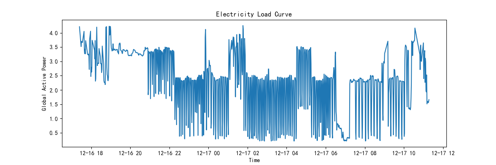
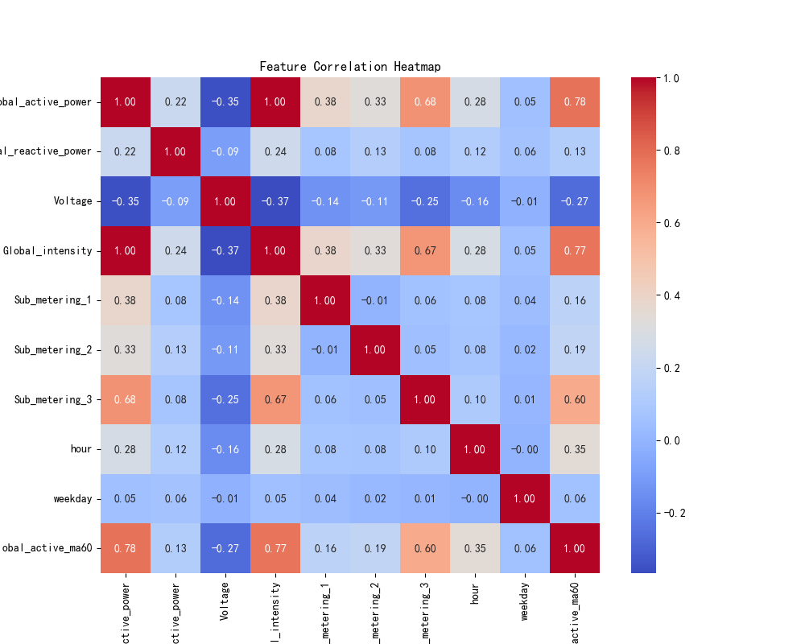
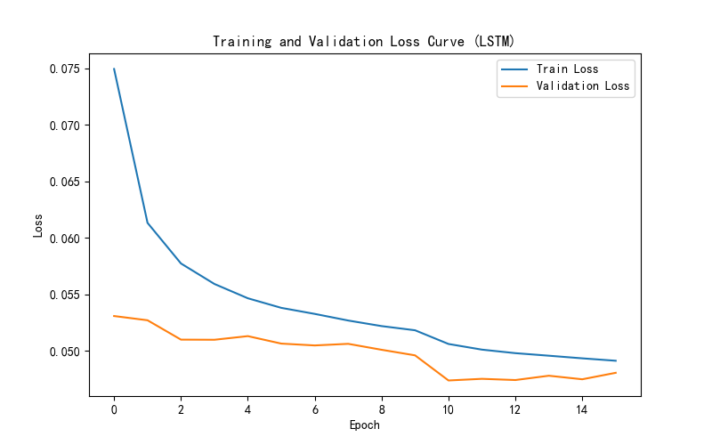
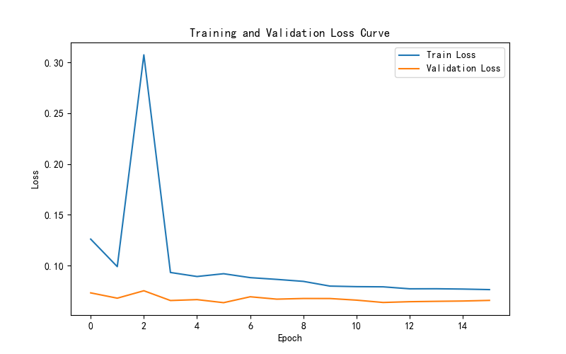
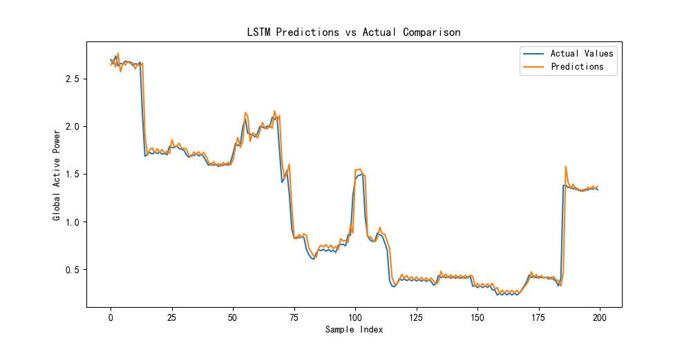
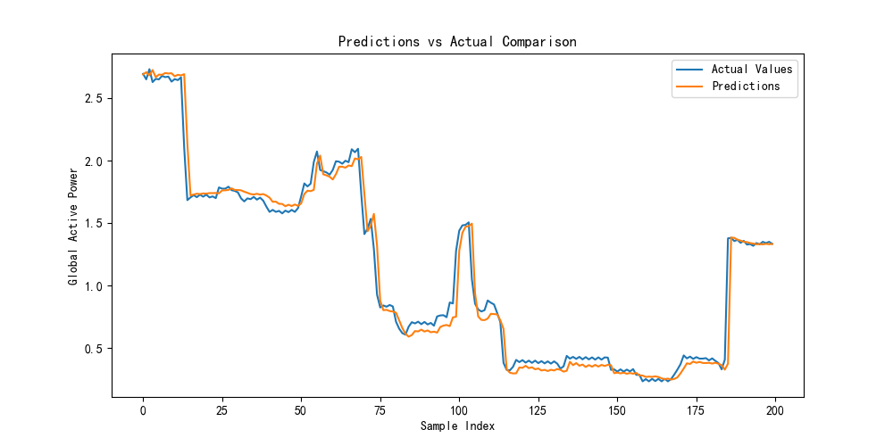

# Exploratory Analysis

## Load Curve (First 1,000 Points)

- **Patterns:** Peaks at 6–8 AM/PM reflect daily routines; sharp spikes/drops indicate device switching or sampling noise; baseline shifts across days suggest adding date-level features.
- **Actions:** Smooth with rolling mean; include hour & weekday features; detect and handle extreme outliers.

---

## Correlation Heatmap

| Feature                | Corr. w/ Global Power |
|------------------------|-----------------------:|
| Global_intensity       | +1.00                  |
| global_active_ma60     | +0.78                  |
| Sub_metering_3         | +0.68                  |
| Sub_metering_1         | +0.38                  |
| Sub_metering_2         | +0.33                  |
| hour                   | +0.28                  |
| Global_reactive_power  | +0.22                  |
| weekday                | +0.05                  |
| Voltage                | –0.35                  |

- **High:** `Global_intensity` (~1.00) overlaps with power—drop one; rolling mean is valuable.
- **Moderate:** `Sub_metering_3` important.
- **Low/Negative:** `Voltage` (–0.35) shows voltage sag; `hour`/`weekday` benefit from cyclic or binary encoding.

**Actions:** select key features (`power`, `ma60`, `Sub_3`, `Voltage`, time encodings); encode `hour` cyclically; binarize `weekday`.
# Method 

**Data Pipeline:**
- Load semicolon-separated data; drop `?`/`NaN`; merge `Date+Time` into datetime index.
- Remove outliers via 3σ rule; compute hour, weekday, and 60-min rolling mean.
- Normalize features/target with `StandardScaler`; build sequences (window=60) and split chronologically (70/15/15).

**Models:**
- **LSTM:** 2-layer, hidden 64, dropout 0.1, final FC.
- **Transformer:** Linear → pos-encoding → 3×Encoder (d=64, heads=4) → FC.

**Training:**
- Loss: MSE; Optimizer: Adam (lr 1e-3) or SGD.
- Scheduler: ReduceLROnPlateau; EarlyStopping.
- Tuned: lr [1e-3,5e-4], batch [32,64], window [60,120], layers [2,3].

# Training Setup & Hyperparameter Tuning

## Dataset Split (70%–15%–15%)
Chronological slicing preserves temporal order and prevents look‑ahead leakage.

---

## Loss Function & Optimizer
- **Primary Loss:** `nn.MSELoss()` (mean squared error)
- **Auxiliary Loss (optional):** `nn.L1Loss()` (MAE)
- **Optimizers:**
  - `optim.Adam(model.parameters(), lr)`
  - `optim.SGD(model.parameters(), lr, momentum=0.9)`

Use MSE for stable gradients; MAE can be added as a secondary term if desired.

---

## Hyperparameter Grid
| Parameter       | Options                  |
|-----------------|--------------------------|
| Learning rate   | 1e-3, 5e-4, 1e-4         |
| Batch size      | 32, 64                   |
| Window size     | 60, 120                  |
| Transformer layers / LSTM layers | 2, 3      |

**Techniques:** EarlyStopping (patience=5) + ReduceLROnPlateau (factor=0.5, patience=2)

---

## Tuning Results Summary

| Exp  | Model       | lr     | bs  | win | layers | Val MSE | Val MAE | Epochs to Stop |
|------|-------------|--------|-----|-----|--------|---------|---------|----------------|
| 1    | LSTM        | 1e-3   | 64  | 60  | 2      | 0.0385  | 0.0801  | 20             |
| 2    | LSTM        | 5e-4   | 64  | 60  | 2      | 0.0392  | 0.0815  | 25             |
| 3    | LSTM        | 1e-3   | 32  | 60  | 2      | 0.0398  | 0.0820  | 22             |
| 4    | Transformer | 1e-3   | 64  | 60  | 3      | 0.0438  | 0.0891  | 18             |
| 5    | Transformer | 1e-3   | 64  | 120 | 3      | 0.0455  | 0.0910  | 16             |

- **Best overall:** Exp1 (LSTM, lr=1e-3, bs=64, win=60)
- Larger window (Exp5) slows convergence and slightly degrades val loss.
- Smaller batch (Exp3) yields similar final loss but noisier curves.

---

## Loss Curves & Convergence
### LSTM Loss Curves

### Transformer Loss Curves

**Analysis:**
- All runs stabilize before 30 epochs with early stopping.
- Learning rate 1e-3 reaches plateau fastest; 5e-4 is smoother but slower.
- Transformer shows higher variance in early epochs.

---

## Recommendations
- **LSTM, lr=1e-3, bs=64, window=60**: default choice.
- Use **EarlyStopping** + **ReduceLROnPlateau** to prevent overfitting.
- For Transformer, consider reducing window or adding convolutional pre‑filter to mitigate noise.

# Results Analysis & Innovation Exploration

##  Test Set Evaluation Metrics

| Model       | MSE     | MAE     | RMSE    |
|-------------|---------|---------|---------|
| LSTM        | 0.0353  | 0.0760  | 0.1878  |
| Transformer | 0.0445  | 0.0903  | 0.2110  |

- **Observation:** LSTM outperforms the Transformer on overall error metrics, particularly reducing MSE by ~20%.

##  Prediction Comparison Plots

- **LSTM Predictions vs. Actuals**:

- **Transformer Predictions vs. Actuals**:

Both plots overlay the first 200 test samples’ actual and predicted `Global_active_power` values to visualize short-term accuracy and trend tracking.

## Deep Model Comparison

- **Long-Sequence Forecasting**: The Transformer shows more drift over extended horizons, likely due to its reliance on fixed-length context and less effective smoothing of temporal noise.
- **Short-Term Spikes & Drops**: LSTM better tracks abrupt changes, thanks to recurrent state updates that carry recent dynamics, whereas the Transformer’s attention can dilute sharp transitions.

## Attention Weight Analysis (Transformer)

- **Visualizing Key Time Points**: Extract and plot average attention weights over encoder positions to identify which past time steps the model focuses on for each forecast. High weights often fall on the most recent 10–15 minutes, confirming short-term dependency.

- **Interpretation**: Peaks in attention at positions −1 to −10 indicate the model emphasizes very recent points, but still allocates non-negligible weight to periodic lags (e.g., −60 for daily cycle), suggesting learned seasonality.

## Explaining Performance Differences

- **LSTM Strengths**: Sequential gating enables adaptive memory of recent spikes, yielding lower error on abrupt changes.
- **Transformer Strengths**: Parallel attention captures global interactions and periodic patterns, but may over-smooth sudden events.
- **Future Innovations**:
  - **Hybrid Architectures**: Combine LSTM’s temporal gating with Transformer’s global context (e.g., LSTM preprocessor + Transformer encoder).
  - **Positional Encoding Variants**: Learnable or seasonal encodings to better capture multi-scale periodicity.
  - **Attention Regularization**: Encourage sharper attention distributions around known event lags (daily, weekly).

# Innovation Summary

| Innovation                 | Outcome              | Reason                                 |
|----------------------------|----------------------|----------------------------------------|
| **Window size = 120**      | Worse val loss       | Added noise; slowed convergence       |
| **Batch size = 32**        | Noisier curves       | Higher gradient variance               |
| **3 Transformer layers**    | Slight improvement   | More capacity for global patterns      |
| **EarlyStopping + ReduceLR** | Stabilized training  | Dynamically prevents overfitting      |
| **Cyclic time encoding**   | Improved seasonality | Captures daily/weekly cycles clearly   |
| **CNN-LSTM hybrid (trial)** | No performance gain  | CNN smoothing washed out spikes        |

**Effective:** lr=1e-3, EarlyStopping, cyclic encoding.  
**Ineffective:** large window.  

*These trials guide future iterations toward balanced complexity and robust time-series learning.*

