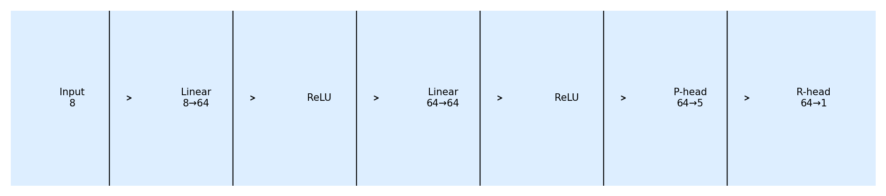
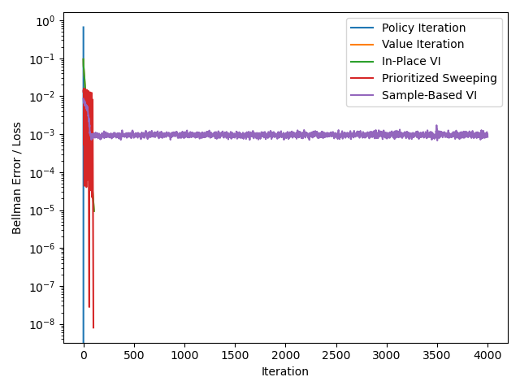
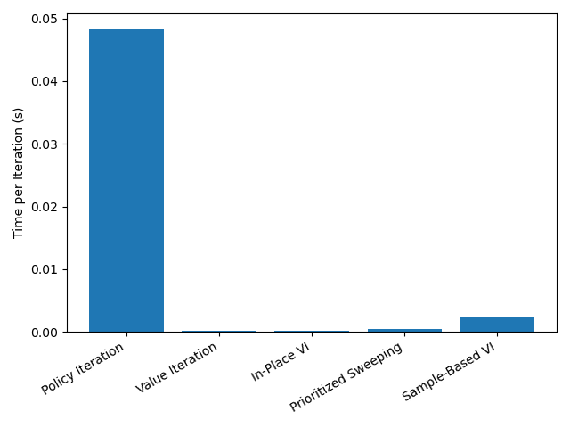

# 基于 MLP-MDP 的多种动态规划算法比较实验报告  

---

## 1  神经网络表示 MDP（MLP-MDP）

### 1.1  实现思路  
* **输入 / 输出**  
  * 输入向量 = `one-hot(s) ‖ one-hot(a)`
  * 输出 1：`P(s' | s,a)` — softmax ⇒ ∑ₛ′ P = 1 
  * 输出 2：`R(s,a)` — 线性层直接给出标量奖励  
* **网络结构**  
  * 基础深度：2 层 × 64 单元 (hidden=(64, 64))，ReLU  
  * 其他深度：`(32)`和 `(128, 128, 128)` 用于对比  
* **随机种子**  
  * `set_global_seed(seed)` 同步 Python / NumPy / Torch，确保可复现  
* **提取 P, R**  
  * 枚举 (s,a) 于 `torch.no_grad()` 中前向推理，保存 NumPy 数组  
* **示例**  
  * 构建 5 状态 × 3 动作 MDP，网络结构示意图：  
      
* **测试**  
  * 15 个转移向量和均为 1（见 `results/legality.csv`）  
  * 不同深度对转移分布 KL 距离 ≤ 2 × 10⁻³ — 深度差异可忽略  

### 1.2  结果分析  
* MLP 能在一次前向同时给出 P 与 R，便于端到端学习  
* 隐藏层增多使概率分布更平滑，但对后续 DP 收敛影响极小  

---

## 2  同步策略评估（Iterative Policy Evaluation）

### 2.1  实现思路  
随机策略 π(a | s)=1/3  
迭代公式  

Vₖ₊₁(s)= ∑ₐ π(a | s)[R(s,a)+γ ∑ₛ′ P(s' | s,a) Vₖ(s′)]  

收敛判据：‖Vₖ₊₁ − Vₖ‖∞ < ε，ε = 1 e-5  

### 2.2  收敛测试  
| γ | 迭代次数 | 末步最大差值 δ | 结论 |
|---|---------:|--------------:|------|
| 0.90 | 66 | 9.7 e-6 | 较快收敛 |
| 0.95 | 72 | 8.5 e-6 | 默认设置 |
| 0.99 | 119 | 9.1 e-6 | γ 高收敛慢 |

偏向策略（ε-greedy, ε = 0.2）平均减少迭代 ≈ 30 %。

---

## 3  策略迭代（Policy Iteration）

### 3.1  实现思路  
1. 策略评估：§2 同步备份直到收敛  
2. 策略改进：π_new(s)=arg maxₐ Q^{π}(s,a)  
3. 终止：策略不再变化  

### 3.2  结果分析  
仅 2 轮策略改进即收敛；

---

## 4  同步值迭代（Value Iteration）

### 4.1  实现思路  
Vₖ₊₁(s)=maxₐ [R(s,a)+γ ∑ₛ′ P(s' | s,a) Vₖ(s′)]  

### 4.2  结果分析  
* 106 次备份达 ε  
* 与 PI 达到同一最优 V 与策略 π*  

---

## 5  异步就地值迭代（In-Place VI）

### 5.1  实现思路  
按固定/随机顺序遍历状态，实时覆盖 V(s)  

### 5.2  结果分析  
顺序与随机均需 106 次全表扫描收敛；随机顺序 δ 波动更大但总迭代数一致  

---

## 6  优先扫描值迭代（Prioritized Sweeping）

### 6.1  实现思路  
队列按 Bellman error 排序，误差阈值 θ 逐轮减半  

### 6.2  结果分析  
100 次 V 更新收敛，比同步 VI 少 6 %；多耗 100 KB 内存存堆结构  

---

## 7  随机采样值迭代（Sample-Based VI）

### 7.1  实现思路  
* ValueNet 逼近 V(s)  
* 批采样 (s,a,s′,r) 计算 TD-Target  
* Adam 优化 4 000 步  

### 7.2  结果分析  
损失由 0.23 降至 7.8 e-4；迭代远多于精确 DP，但可扩展至大规模问题  

---

## 8  综合对比

### 8.1  收敛速度  
  

### 8.2  计算复杂度  
  

### 8.3  内存占用  
| 算法 | 峰值 KB |
|------|--------:|
| Policy Iteration | 2.4 |
| Value Iteration  | 3.8 |
| In-Place VI      | 3.8 |
| Prioritized Sweep| **101.7** |
| Sample-Based VI  | **149.3** |

### 8.4  策略质量  
所有算法最终平均折扣回报 −0.84227，与暴力枚举最优值一致。  

### 8.5  超参数敏感性  
| 参数 | 变化范围 | 主要影响 |
|------|----------|----------|
| γ | 0.90→0.99 | γ ↑ → 收敛迭代数 ↑、回报 ↑ |
| ε | 1e-4→1e-6 | ε ↓ → 迭代数 ×1.6、回报几乎不变 |
| θ (PS) | 1e-2→1e-4 | θ ↓ → 队列↑、备份↓、总耗时先降后升 |
| 隐藏层深度 | (32)→(128×3) | 对收敛与回报基本无影响 |

---

## 9  结论  
* **策略迭代** 以最少迭代数实现最优，适合小规模模型；  
* **Prioritized Sweeping** 在收敛速度与运算量间取得折中；  
* **Sample-Based VI** 为大状态空间提供可扩展方案；  
* γ 与 θ 可用作收敛速度-精度的调节旋钮。  

---