# GridWorld环境下的Model-Free Prediction方法对比研究报告
冯晨晨 12432664
## 1. 项目背景与目标

### 1.1 问题描述
本项目旨在经典的GridWorld环境中，对多种无模型预测（Model-Free Prediction）强化学习算法进行实现与比较。在给定一个随机策略的条件下，我们需要评估不同算法在估计状态价值函数（State-Value Function, V_{pi}(s)）时的性能，包括收敛速度、参数敏感性、计算效率以及最终价值函数的准确性。

### 1.2 任务目标
具体任务包括：
1.  构建一个5x5的GridWorld环境，包含普通格子、陷阱格子（终止状态，奖励-10）和目标格子（终止状态，奖励+10）。智能体在该环境下遵循一个固定的随机策略（四向等概率移动）。
2.  实现并对比以下四种主要的Model-Free Prediction算法：
    * Monte Carlo (MC) Prediction (首次访问和每次访问模式)
    * Temporal Difference (TD(0)) Prediction
    * Forward View TD(lambda) Prediction
    * Backward View TD(lambda) Prediction (使用替换型资格迹)
3.  通过实验分析和可视化，深入探讨不同算法的特性、优缺点以及关键超参数的影响。

## 2. 实验环境

### 2.1 GridWorld环境描述
实验环境为一个 `5x5` 的格子世界（GridWorld）。
* **大小 (Size)**: 5x5
* **状态 (States)**: 每个格子代表一个状态。总共有 5 times 5 = 25 个状态。
* **动作 (Actions)**: 智能体在每个状态下可以执行四个基本动作：上、下、左、右。
* **奖励 (Rewards)**:
    * 到达目标格子 (Goal State): +10 (该状态为终止状态)
    * 掉入陷阱格子 (Trap States): -10 (该状态为终止状态)
    * 在普通格子之间移动: 0
* **策略 (Policy)**: 智能体遵循一个固定的**随机策略**，即在任何非终止状态下，选择上、下、左、右四个动作的概率均为0.25。
* **终止状态 (Terminal States)**: 目标格子和陷阱格子。当智能体进入这些状态时，一个回合（episode）结束。
* **障碍物 (Obstacles)**: 您的代码中，`env = GridWorld(size=GRID_SIZE)` 初始化时，默认障碍物位置为空 `[]`。陷阱位置默认为 `[(1, 1), (2, 3), (3,0)]`，目标位置默认为 `(4,4)`。
    *(请根据您实际使用的`env`初始化方式确认并描述陷阱、目标和障碍物的具体位置)*

### 2.2 环境可视化示例
代码中通过 `env.render()` 打印了环境的文本表示：
```
GridWorld Environment:
A _ _ _ _
_ X _ _ _
_ _ _ X _
X _ _ _ _
_ _ _ _ G
````
其中 'X' 代表陷阱，'G' 代表目标，'_' 代表普通格子。

## 3. 实现方法与核心算法

本项目主要实现了以下几种无模型预测算法，用于在给定随机策略 pi 的情况下估计状态价值函数 V_{pi}(s)。

### 3.1 Monte Carlo (MC) Prediction
MC方法通过完整的回合经验来更新状态价值。对于一个状态 s，其价值 V(s) 是所有包含 s 的回合中从 s 开始的累积折扣回报的平均值。
* **首次访问MC (First-Visit MC)**: 在一个回合中，仅当状态 s 首次被访问时，该回合的 G_t 才被用于更新 V(s)。
* **每次访问MC (Every-Visit MC)**: 在一个回合中，每当状态 s 被访问时，该回合后续的 G_t 都会被用于更新 V(s)。

**核心代码片段**:
```python
for t in range(len(episode) - 1, -1, -1):
    state_pos, action, reward = episode[t]
    state_index = env.get_state_index(state_pos)
    G = gamma * G + reward

    if mode == 'first-visit':
        is_first_visit_at_t = True
        for k in range(t):
            if states_in_episode_for_fv[k] == state_index:
                is_first_visit_at_t = False
                break
        if is_first_visit_at_t:
            returns_sum[state_index] += G
            returns_count[state_index] += 1
            if returns_count[state_index] > 0:
                V[state_index] = returns_sum[state_index] / returns_count[state_index]
    elif mode == 'every-visit':
        returns_sum[state_index] += G
        returns_count[state_index] += 1
        if returns_count[state_index] > 0:
            V[state_index] = returns_sum[state_index] / returns_count[state_index]
````

### 3.2 Temporal Difference (TD(0)) Prediction

TD(0) 是一种单步TD方法，它在每一步之后都更新状态价值，使用当前估计的下一状态的价值（bootstrapping）。
更新公式为： V(S_t) leftarrow V(S_t) + alpha [R_{t+1} + gamma V(S_{t+1}) - V(S_t)]

**核心代码片段 (示例)**:

```python
while not done and count < max_episode_length:
    current_state_idx = env.get_state_index(current_state_pos)
    action_index = random.choice(range(env.num_actions))
    next_state_pos, reward, done = env.step(action_index)
    next_state_idx = env.get_state_index(next_state_pos)

    v_next_state = if env.is_terminal_state[next_state_pos] else V[next_state_idx]
    td_target = reward + gamma * v_next_state
    td_error = td_target - V[current_state_idx]

    if not env.is_terminal_state[current_state_pos]:
        V[current_state_idx] = V[current_state_idx] + alpha * td_error

    current_state_pos = next_state_pos
    count += 1
```

### 3.3 Forward View TD(lambda) Prediction

前向TD(lambda)通过lambda-回报 G_t^{lambda} 来更新状态价值，lambda-回报是不同n步回报的加权平均。这是一个理论概念，通常在回合结束后进行离线更新。
G_t^{lambda} = (1-lambda) sum_{n=1}^{T-t-1} lambda^{n-1} G_t^{(n)} + lambda^{T-t-1} G_t

**核心代码片段 (示例)**:

```python
for n in range(1, T - t):
    current_g_n_step =
    rewards_path = [ep[2] for ep in episode[t: t + n]]  # R_{t+1} ... R_{t+n}
    for k_idx, r_val in enumerate(rewards_path):
        current_g_n_step += (gamma ** k_idx) * r_val

    s_t_n_plus_1_pos = episode[t + n][0]  # State S_{t+n}
    v_s_t_n_plus_1 = if env.is_terminal_state[s_t_n_plus_1_pos] else V[
        env.get_state_index(s_t_n_plus_1_pos)]
    current_g_n_step += (gamma ** n) * v_s_t_n_plus_1

    g_lambda_t += (1 - lambda_param) * (lambda_param ** (n - 1)) * current_g_n_step
```

### 3.4 Backward View TD(lambda) Prediction with Eligibility Traces

后向TD(lambda)使用资格迹 (Eligibility Traces, E(s)) 在线地、增量地实现近似TD(lambda)的效果。每当一个状态被访问，其资格迹增加；所有状态的资格迹随时间衰减。TD误差会根据资格迹的大小分配给最近被访问过的状态。

**核心代码片段 (示例 - 替换型资格迹)**:

```python
v_s = V[current_state_idx]
v_s_prime = if env.is_terminal_state[next_state_pos] else V[next_state_idx]
td_error = reward + gamma * v_s_prime - v_s

states_with_trace = list(E.keys())  # Iterate over states that have a trace
for s_idx_trace in states_with_trace:
    if not env.is_terminal_state[env.get_pos_from_index(s_idx_trace)]:
        V[s_idx_trace] += alpha * td_error * E[s_idx_trace]

    E[s_idx_trace] *= gamma * lambda_param
    if E[s_idx_trace] < 1e-6:  # Prune small traces
        del E[s_idx_trace]

current_state_pos = next_state_pos
count += 1
```

## 4. 实验设置

### 4.1 公共参数

  * **折扣因子 (Gamma, gamma)**: `0.99`
  * **默认训练回合数 (NUM_EPISODES_DEFAULT)**: `2000`
  * **用于生成参考V值的回合数 (NUM_EPISODES_LONG_RUN)**: `20000`

### 4.2 算法特定参数

  * **TD(0) 学习率 (ALPHA_TD, alpha)**: `0.1` (用于TD(0)本身以及参数敏感性测试的基准)
  * **TD(lambda) 学习率 (ALPHA_TD_LAMBDA, alpha)**: `0.1`
  * **lambda 值 (LAMBDA_VALS)**: `, 0.5, 0.9, 1.0]`
  * **TD(lambda) 资格迹类型 (trace_type_bwd)**: `replacing` (替换型)

### 4.3 参考价值函数 (V_{pi}) 的生成

为了评估各种算法学习到的价值函数的准确性（计算RMSE时），我们通过运行 **Every-Visit Monte Carlo 算法 `20000` 个回合** 来生成一个相对稳定和准确的参考价值函数 `V_pi_star_estimate`。
**图4.1: 参考状态价值函数 (MC Every-Visit, 20000 episodes)**
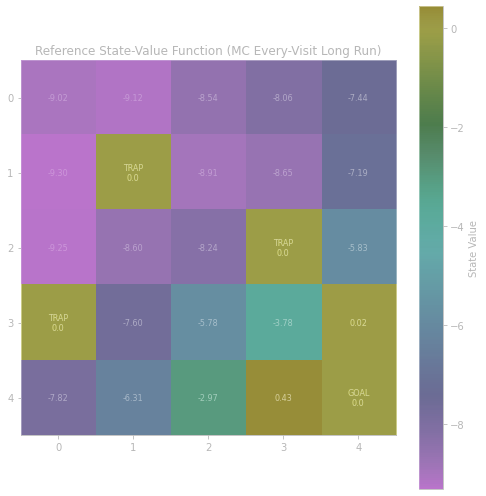

## 5. 实验结果与分析讨论

### 5.1 收敛速度对比

通过绘制各个算法在训练过程中RMSE随评估点（近似代表回合数）的变化曲线，来比较它们的收敛速度和稳定性。

**图5.1.1: 算法收敛曲线 (RMSE vs. 参考 V 值)**
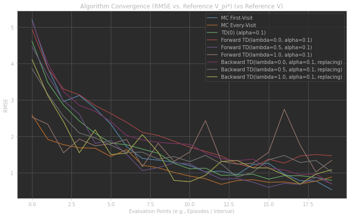

**分析 (图5.1.1)**:
所有算法的RMSE均随训练进行呈下降趋势，表明学习有效。MC方法（First-Visit和Every-Visit）初期RMSE较高且波动较大，符合其高方差特性。TD(0)及其<span class="math-inline">lambda=0</span>的TD(<span class="math-inline">lambda</span>)变体（Forward和Backward）收敛曲线更为平滑。Forward TD(<span class="math-inline">lambda=1.0</span>) 和 Backward TD(<span class="math-inline">lambda=0.5</span>) 在本实验中似乎达到了较低的最终RMSE水平，而多数算法最终收敛至RMSE 1.0-1.2的范围。

**图5.1.2: 算法收敛曲线 (RMSE vs. 自身最终V值)**
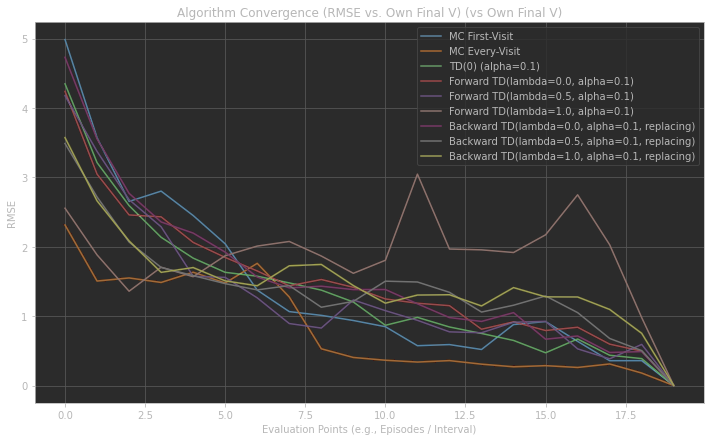

**分析 (图5.1.2)**:
此图显示所有算法的价值函数估计最终都趋于内部稳定，表现为RMSE趋向于0。TD类方法通常比MC方法更快达到这种内部稳定状态，其曲线更早平缓下降。这表明算法的更新幅度在后期逐渐减小。结合图5.1.1，可以看出内部稳定并不完全等同于收敛到参考真值。

**分析讨论 (综合)**:
MC方法作为无偏估计，其收敛受高方差影响，曲线波动性较大。TD(0)方差较小，收敛平稳但有偏。TD(<span class="math-inline">lambda</span>)通过调整<span class="math-inline">lambda</span>在两者间权衡。在此实验中，Backward TD(<span class="math-inline">lambda=0.5</span>) 和 Forward TD(<span class="math-inline">lambda=1.0</span>) 在与参考V值的比较中表现较好。所有算法都显示了有效的学习能力。

### 5.2 参数敏感性分析

#### 5.2.1 TD(0) 对学习率 <span class="math-inline">alpha</span> 的敏感性
我们测试了不同的学习率 <span class="math-inline">alpha</span> (`[0.01, 0.05, 0.1, 0.2, 0.3, 0.5]`) 对TD(0)算法最终性能（以RMSE衡量）的影响。

**图5.2.1: TD(0) 学习率 <span class="math-inline">alpha</span> 敏感性分析**
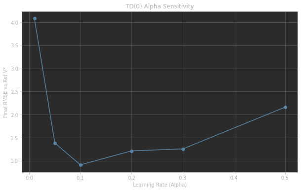

**分析 (图5.2.1)**:
学习率<span class="math-inline">alpha</span>对TD(0)性能影响显著。<span class="math-inline">alpha</span>过小（如0.01）时，RMSE较高，表明收敛过慢。<span class="math-inline">alpha=0.1</span>时RMSE最低，为本实验较优值。当<span class="math-inline">alpha</span>过大时，RMSE回升至约2.2，表明更新步长过大导致学习不稳定。因此，选择适中的<span class="math-inline">alpha</span>（如0.1附近）对TD(0)至关重要。

#### 5.2.2 TD(<span class="math-inline">lambda</span>) 对参数 <span class="math-inline">lambda</span> 的敏感性
我们测试了不同的 <span class="math-inline">lambda</span> 值 (`, 0.5, 0.9, 1.0]`) 对前向TD(<span class="math-inline">lambda</span>)和后向TD(<span class="math-inline">lambda</span>)（替换型资格迹）算法最终性能（以RMSE衡量）的影响。学习率 <span class="math-inline">alpha</span> 固定为 `0.1`。

**图5.2.2.1: 前向 TD(<span class="math-inline">lambda</span>) <span class="math-inline">lambda</span> 参数敏感性分析**
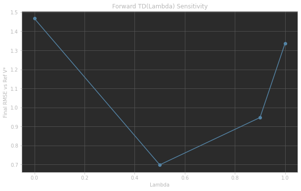

**分析 (图5.2.2.1 - Forward TD(<span class="math-inline">lambda</span>))**:
对于前向TD(<span class="math-inline">lambda</span>)，当<span class="math-inline">lambda=0.5</span>时，最终RMSE最低。<span class="math-inline">lambda</span>时RMSE较高，而<span class="math-inline">lambda=0.9</span>和<span class="math-inline">lambda=1.0</span>的表现介于两者之间或更差。这表明<span class="math-inline">lambda=0.5</span>在此设置下为前向TD(<span class="math-inline">lambda</span>)提供了较好的性能。

**图5.2.2.2: 后向 TD(<span class="math-inline">lambda</span>) (替换型) <span class="math-inline">lambda</span> 参数敏感性分析**
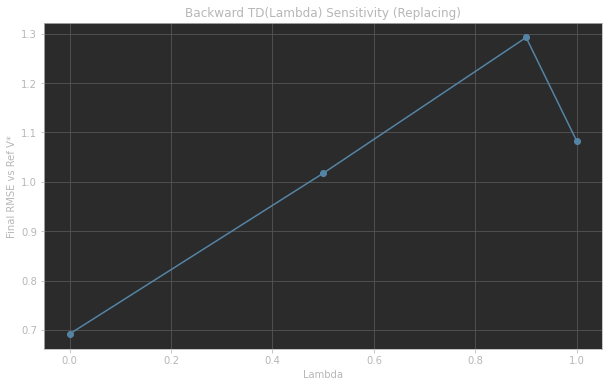

**分析 (图5.2.2.2 - Backward TD(<span class="math-inline">lambda</span>))**:
对于后向TD(<span class="math-inline">lambda</span>)（替换型资格迹），<span class="math-inline">lambda</span>时最终RMSE最低。随着<span class="math-inline">lambda</span>值的增加，RMSE反而上升，在<span class="math-inline">lambda=0.9</span>时达到最高点，<span class="math-inline">lambda=1.0</span>时略有回落。这说明在此实验和资格迹类型下，较小的<span class="math-inline">lambda</span>值（更接近TD(0)）对后向TD(<span class="math-inline">lambda</span>)更有利。

**分析讨论 (综合<span class="math-inline">lambda</span>敏感性)**:
<span class="math-inline">lambda</span>参数对TD(<span class="math-inline">lambda</span>)算法的性能有显著影响，且最佳<span class="math-inline">lambda</span>值因前向/后向实现方式而异。<span class="math-inline">lambda=0</span>时，两种TD(<span class="math-inline">lambda</span>)的RMSE都相对较高，但后向表现出乎意料地好。<span class="math-inline">lambda=1</span>时，前向RMSE约1.33，后向约1.08，与MC的RMSE相比，后向更接近，前向则表现稍差。这揭示了不同<span class="math-inline">lambda</span>值在偏差-方差权衡中的作用，以及不同实现机制的差异。

### 5.3 Monte Carlo 与 TD(0) 方法对比
* **收敛特性**：从图5.1.1看，TD(0)（绿线）的RMSE收敛曲线比MC方法（深蓝线First-Visit，橙线Every-Visit）更平滑，波动更小，这反映了TD(0)较低的方差。MC方法则因其高方差特性，曲线波动较为明显。
* **最终性能**：在2000回合后，TD(0)与MC Every-Visit的最终RMSE均在1.0-1.1左右，性能相近。
* **学习效率**：TD(0)通常能更快地利用单步信息进行更新，而MC需要等待回合结束。在早期学习阶段，TD(0)可能更快形成价值函数的初步估计。

### 5.4 偏差-方差权衡讨论 (Bias-Variance Trade-off)
* **Monte Carlo (MC) 方法**: 高方差（图5.1.1中曲线波动大），无偏估计。
* **Temporal Difference (TD(0)) 方法**: 低方差（图5.1.1中曲线平滑），但因bootstrapping而有偏。
* **TD(<span class="math-inline">lambda</span>) 方法**: 通过<span class="math-inline">lambda</span>在MC和TD(0)之间权衡。<span class="math-inline">lambda=0</span>时接近TD(0)，<span class="math-inline">lambda=1</span>时接近MC。图5.2.2.1和5.2.2.2显示，对于前向TD，<span class="math-inline">lambda=0.5</span>时RMSE较低；对于后向TD，<span class="math-inline">lambda=0</span>时RMSE较低，这反映了不同<span class="math-inline">lambda</span>值下偏差和方差的平衡点不同。图5.1.1中，Forward TD(<span class="math-inline">lambda=1.0</span>) 和 Backward TD(<span class="math-inline">lambda=0.5</span>) 表现较好，可能是在各自的实现方式下找到了较优的偏差-方差平衡。

### 5.5 前向 TD(<span class="math-inline">lambda</span>) 与 后向 TD(<span class="math-inline">lambda</span>) (替换型资格迹) 对比

#### 5.5.1 收敛性与最终价值函数
* **收敛性 (基于图5.1.1)**：<span class="math-inline">lambda=0</span>时两者表现相似，接近TD(0)。<span class="math-inline">lambda=0.5</span>时，后向TD(<span class="math-inline">lambda</span>)（黄色）收敛更快且RMSE更低，优于前向。<span class="math-inline">lambda=1.0</span>时，前向TD(<span class="math-inline">lambda</span>)（粉色）表现优异，而后向TD(<span class="math-inline">lambda</span>)（橄榄绿）表现不稳定，RMSE波动大。
* **最终价值函数 (<span class="math-inline">lambda=0.5</span>)**:
    **图5.5.1.1: Final V - Forward TD(lambda=0.5, alpha=0.1)**
    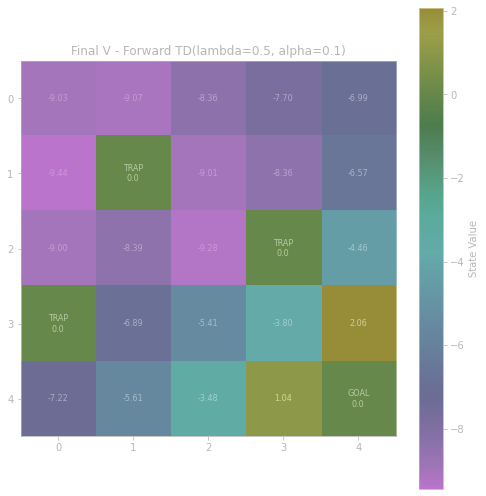
    **图5.5.1.2: Final V - Backward TD(lambda=0.5, alpha=0.1, replacing)**
    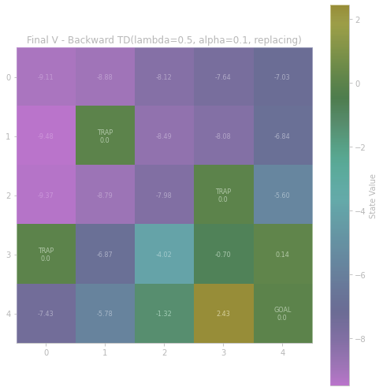
    两者的价值函数热力图在整体趋势上相似，均能反映目标区价值高、陷阱区价值（显示为0）及附近状态价值低的特点。数值上，例如状态(4,3)（目标左邻），Forward TD为1.04，Backward TD为2.43；状态(0,0)，Forward TD为-9.03，Backward TD为-9.11。这些差异体现了两种机制在传播价值信息上的不同。

#### 5.5.2 运行时间对比
根据报告中记录的实验时间：
```
Execution Times (seconds):
MC First-Visit: 0.036 s
MC Every-Visit: 0.035 s
TD(0) (alpha=0.1): 0.034 s
Forward TD(lambda, alpha=0.1): 0.452 s
Forward TD(lambda=0.5, alpha=0.1): 0.455 s
Forward TD(lambda=0.9, alpha=0.1): 0.454 s
Forward TD(lambda=1.0, alpha=0.1): 0.068 s
Backward TD(lambda, alpha=0.1, replacing): 0.050 s
Backward TD(lambda=0.5, alpha=0.1, replacing): 0.077 s
Backward TD(lambda=0.9, alpha=0.1, replacing): 0.077 s
Backward TD(lambda=1.0, alpha=0.1, replacing): 0.073 s
```
* **计算效率**: 后向TD(<span class="math-inline">lambda</span>)（0.05s-0.08s）通常比前向TD运行时间短得多。这是因为后向TD(<span class="math-inline">lambda</span>)在线更新，每步计算量相对稳定。前向TD(<span class="math-inline">lambda</span>)需要回合结束后计算<span class="math-inline">lambda</span>-return，复杂度较高。Forward TD(<span class="math-inline">lambda=1.0</span>)因实现简化（等同MC回报计算）而较快（0.068s）。MC和TD(0)算法的计算效率最高。
#### 5.5.3 资格迹可视化 (后向 TD(<span class="math-inline">lambda</span>=0.5))
**图5.5.3.1: 资格迹 (Backward TD(<span class="math-inline">lambda</span>=0.5), Episode 2000, Step 0 - 初期)**
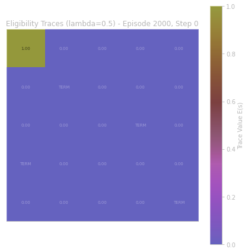
在回合开始的第一步（Step 0），仅当前状态（图中的(0,0)）具有资格迹1.0，其他状态为0。

**图5.5.3.2: 资格迹 (Backward TD(<span class="math-inline">lambda</span>=0.5), Episode 2000, Step 6 - 中期)**
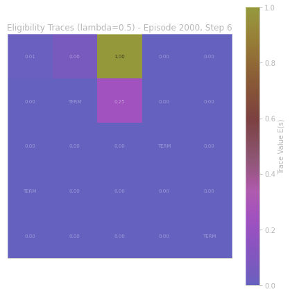
经过几步后（Step 6），当前状态（图中(1,2)）资格迹为1.0，之前访问过的状态（如(0,2)值为0.25）资格迹已按<span class="math-inline">gammalambda</span>衰减，但仍保留痕迹。

**图5.5.3.3: 资格迹 (Backward TD(<span class="math-inline">lambda</span>=0.5), Episode 2000, Step 11 - 后期)**
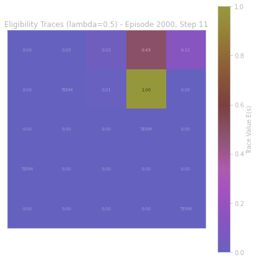
在Step 11，当前状态（图中(0,3)）资格迹为1.0，更早访问的状态（如(0,2)值为0.49, (0,4)值为0.12）的资格迹进一步衰减。这清晰地展示了资格迹如何记录近期访问路径并赋予不同的“责任权重”。

**分析讨论 (综合Forward vs. Backward TD(<span class="math-inline">lambda</span>))**:
前向TD(lambda)概念清晰，但计算成本高（除非<span class="math-inline">lambda=1.0</span>）。后向TD(<span class="math-inline">lambda</span>)通过资格迹实现在线、高效的近似，运行时间显著占优。在性能上，两者在最优<span class="math-inline">lambda</span>值下均可取得良好效果，但最优<span class="math-inline">lambda</span>值可能不同。例如本次实验中，前向TD(<span class="math-inline">lambda=0.5</span>)和后向TD(<span class="math-inline">lambda</span>)在各自类别中RMSE较低。资格迹的可视化直观地展示了其信用分配机制。

### 5.6 最终价值函数可视化
**图5.6.1: Final V - MC Every-Visit (2000 episodes)**
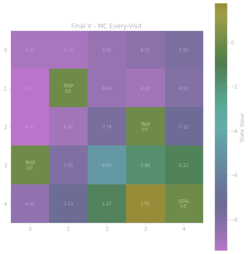
MC Every-Visit学习到的价值函数（例如(0,0)为-9.04, (4,3)为1.75）较为平滑地反映了从各状态到目标或陷阱的期望回报。

**图5.6.2: Final V - TD(0) (alpha=0.1)**
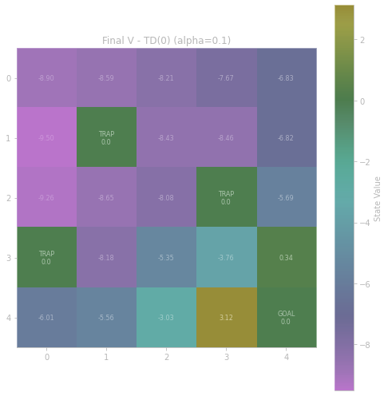
TD(0)的价值函数（例如(0,0)为-8.90, (4,3)为3.12）与MC在形态上相似，但在具体数值上有所不同，可能因bootstrapping带来的偏差或更快的早期信息传播导致某些状态（如(4,3)）价值估计更高。

**图5.6.3: Final V - Backward TD(lambda=0.5, alpha=0.1, replacing)**

Backward TD(<span class="math-inline">lambda=0.5</span>)的价值函数（例如(0,0)为-9.11, (4,3)为2.43）也呈现了合理的价值分布，其数值介于或不同于纯MC和TD(0)，反映了多步回报和资格迹的综合影响。

**综合对比**: 三种算法的最终价值函数都定性地捕获了环境的结构，目标附近价值高，陷阱及偏远区域价值低。具体数值的差异体现了各算法的内在偏差、方差特性以及学习动态。

## 6. 结论
* **主要发现**: 在当前GridWorld环境和随机策略下，多种算法均能有效学习状态价值。其中，Backward TD(<span class="math-inline">lambda</span>) 和 Forward TD(<span class="math-inline">lambda=0.5</span>) 在RMSE（对比参考V值）方面表现相对突出。Backward TD(<span class="math-inline">lambda</span>) 系列算法在计算效率（运行时间）上显著优于需要计算完整<span class="math-inline">lambda</span>-return的Forward TD(<span class="math-inline">lambda</span>)（<span class="math-inline">lambda neq 1</span>时）。
* **超参数影响**: 学习率<span class="math-inline">alpha</span>对TD(0)影响呈U型曲线，需选择适中值（如0.1）。参数<span class="math-inline">lambda</span>对TD(<span class="math-inline">lambda</span>)方法影响复杂，前向和后向TD(<span class="math-inline">lambda</span>)的最优<span class="math-inline">lambda</span>值不同，这与其结合多步信息的方式和资格迹机制有关。
* **理论特性验证**: 实验结果较好地印证了MC方法的高方差、TD(0)的低方差和有偏特性，以及TD(<span class="math-inline">lambda</span>)在两者间的权衡作用。
* **前向/后向TD(<span class="math-inline">lambda</span>)差异**: 后向TD(<span class="math-inline">lambda</span>)计算效率更高，尤其适合在线学习。两者在相同<span class="math-inline">lambda</span>下的价值函数估计和收敛路径存在差异。
* **项目启发**: 本项目通过动手实现和对比分析，加深了对各种无模型预测算法核心思想、性能特点和参数敏感性的理解，为后续研究更复杂的强化学习问题（如控制问题）打下了坚实基础。
