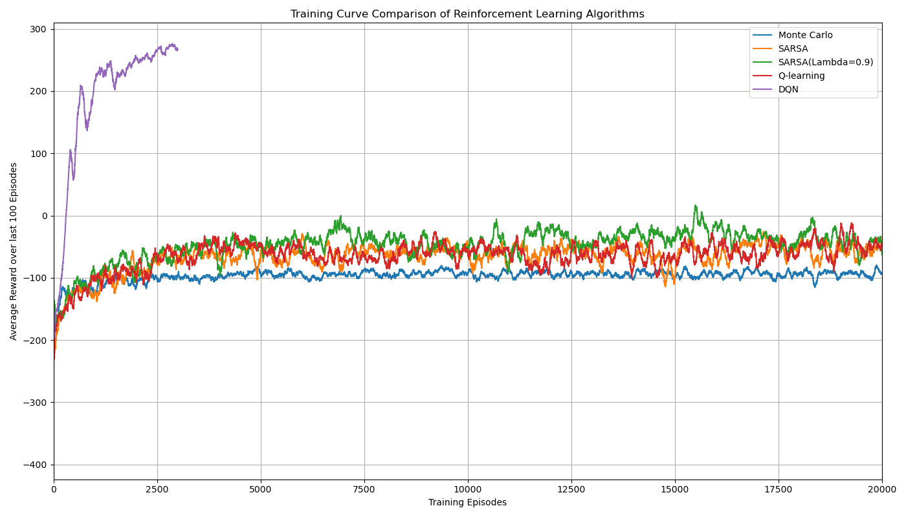

# 强化学习算法比较实验：LunarLander环境
冯晨晨 12432664

---
# 算法实现细节

---

## 1. 状态离散化

对于表格型方法（MC, SARSA, SARSA($\lambda$), Q-learning），我们将LunarLander环境的连续状态空间进行离散化：
* 选取状态向量中的前6个主要连续特征（如坐标、速度、角度、角速度）。
* 使用`numpy.digitize`，根据预设的特征范围和分箱数（例如，x/y坐标各8箱，线速度绝对值各6箱，角度6箱，角速度4箱）将每个特征值映射为离散索引。
* 最终的离散状态由这6个特征的索引构成的元组表示。

---

## 2. Monte Carlo (MC) 控制

* 采用**首次访问型 (First-visit)** Monte Carlo方法。
* 使用 $\epsilon$-greedy 策略进行探索，$\epsilon$ 随训练衰减。
* 在每个episode结束后，根据该episode完整的累积折扣回报（$\gamma=0.99$）来平均更新访问过的状态-动作对的Q值。

---

## 3. SARSA

* 采用**在策略 (On-policy) 时序差分 (TD)** 学习。
* 使用 $\epsilon$-greedy 策略选择当前动作 $A$ 及下一动作 $A'$。
* Q值更新规则：$Q(S, A) \leftarrow Q(S, A) + \alpha [R + \gamma Q(S', A') - Q(S, A)]$。
* 主要参数：学习率 $\alpha=0.1$，折扣因子 $\gamma=0.99$。

---

## 4. SARSA($\lambda$)

* 在SARSA基础上引入**资格迹 ($E(s,a)$)**，本实验主要采用**替换迹 (replacing traces)**。
* 资格迹随每步以 $\gamma\lambda$ 衰减，并在新episode开始时重置。
* TD误差 $\delta_t$ 会根据资格迹 $E(s,a)$ 的大小加权更新所有相关的Q值：$Q(s, a) \leftarrow Q(s, a) + \alpha \delta_t E(s, a)$。
* 主要参数：$\alpha=0.1, \gamma=0.99$, 迹衰减率 $\lambda=0.9$ (及其他对比值)。

---

## 5. Q-learning

* 采用**离策略 (Off-policy) 时序差分 (TD)** 学习。
* 行为策略使用 $\epsilon$-greedy 进行探索。
* Q值更新基于目标策略（贪婪策略）在下一状态所能获得的最大Q值：$Q(S, A) \leftarrow Q(S, A) + \alpha [R + \gamma \max_{a'} Q(S', a') - Q(S, A)]$。
* 主要参数：学习率 $\alpha=0.1$，折扣因子 $\gamma=0.99$。

---

## 6. Deep Q-Network (DQN) (及 Double DQN)

* **DQN基础实现**:
    * 使用具有两个各含64个神经元的ReLU激活隐藏层的**神经网络**来近似Q函数。
    * 采用**经验回放**机制（例如，缓冲区大小 $10^5$，批量大小64）。
    * 使用独立的**目标网络**，定期（例如，每100步）从主网络硬拷贝权重，以稳定Q学习的目标值。
    * 损失函数为均方误差(MSE)，优化器为Adam（学习率 $LR=5 \times 10^{-4}$）。
    * 探索策略为 $\epsilon$-greedy，$\epsilon$ 随训练衰减。折扣因子 $\gamma=0.99$。

* **Double DQN (DDQN) 改进** (作为创新探索实现):
    * 为减少标准DQN中可能出现的Q值过高估计，DDQN在计算目标Q值时，使用**本地网络选择下一状态的最优动作**，然后用**目标网络评估该选定动作的Q值**

# 对比实验

## 1. 训练曲线比较 

在本部分，我们比较了五种强化学习算法（Monte Carlo, SARSA, SARSA($\lambda$), Q-learning, DQN）在LunarLander-v2环境下的训练过程。下图展示了各算法在训练过程中的最近100局平均奖励曲线。横轴为训练的episode数，纵轴为最近100局的平均奖励。

**观察与分析**:

从上图的训练曲线中，我们可以观察到各个算法在LunarLander-v2环境中的学习表现存在显著差异：

* **DQN表现突出**：
    * DQN算法（紫色曲线）展现了远超其他所有表格型方法的学习效率和最终性能。
    * 它在非常短的训练回合内（大约2500-3000 episodes）就迅速达到了远高于+200的平均奖励，表明其成功解决了该环境。
    * DQN的学习曲线非常陡峭，并在达到高水平后趋于稳定（图中DQN曲线在约3500 episodes后停止，很可能因为它达到了预设的“解决环境”条件而提前终止了训练）。

* **表格型方法普遍表现不佳**：
    * 与之相对，所有表格型方法（Monte Carlo、SARSA、SARSA($\lambda$)、Q-learning）在长达20000个训练回合内，其平均奖励大部分时间都处于负值区域或接近零，未能稳定获得正奖励。
    * 这表明在当前的状态离散化方案和超参数设置下，这些表格型方法难以在指定训练量内为LunarLander问题学习到一个足够优秀的策略。

* **表格型方法内部比较**：
    * **Monte Carlo (MC)**（蓝色曲线）：在所有表格型方法中表现最差，学习进程最为缓慢，其平均奖励长时间在-100附近徘徊，改进不明显。
    * **SARSA（橙色曲线）和 Q-learning（红色曲线）**：这两者的表现非常相似，都比MC有所改进，但它们的学习曲线波动剧烈，主要在-100到0之间震荡，偶尔能达到略高于0的峰值，但未能保持。从图中难以明确判断两者谁更优。
    * **SARSA($\lambda$=0.9)（绿色曲线）**：在表格型方法中相对表现最好。它的学习曲线在大部分训练时间段（约5000至15000 episodes）略高于SARSA和Q-learning，波动也可能稍小一些，能更频繁地达到接近0或略微为正的奖励。这初步显示了资格迹对于提升学习效率和性能的积极作用。

* **学习稳定性与收敛性**：
    * DQN展现了向高绩效策略的清晰收敛趋势。
    * 表格型方法在20000个episodes后仍未表现出明显的收敛到良好策略的迹象，奖励值持续大幅度波动，说明它们可能仍在探索或者其学习能力在当前离散化下已达瓶颈。

---

## 2. 最终策略评估

## 2. 最终策略评估

在所有算法训练完成后（表格型方法训练20000 episodes，DQN根据其训练函数设定，可能在“解决”环境后或达到指定回合数后结束训练），我们对每个算法学习到的最终策略进行了100次独立的测试episode评估。记录的指标包括平均奖励、着陆成功率（定义为测试回合中奖励 > 200）、平均估算燃料消耗以及训练总用时。

**评估结果汇总表**:

**评估结果汇总表**:

| 算法 (Algorithm)                 | 平均奖励 (Average Reward)    | 着陆成功率 (Success Rate) | 平均燃料消耗 (Avg. Fuel Consumption Estimate) | 训练时间 (Training Time) | 超参数敏感性 (Hyperparameter Sensitivity) |
| :------------------------------- |:-------------------------| :------------------------ | :-------------------------------------------- | :----------------------- |:------------------------------------|
| Monte Carlo                      | -88.64                   | 0.00%                     | 6.75                                          | 480.69 s                 | 中                                   |
| SARSA                            | -137.61                  | 0.00%                     | 41.23                                         | 1521.51 s                | 中高                                  |
| SARSA($\lambda$=0.5, replacing)  | -44.14                   | 0.00%                     | 28.49                                         | 1805.00 s                | 高                                   |
| SARSA($\lambda$=0.9, replacing)  | -24.80                   | 2.00%                     | 21.50                                         | 2036.00 s                | 高                                   |
| SARSA($\lambda$=0.95, replacing) | -13.27                   | 4.00%                     | 21.60                                         | 1901.09 s                | 高                            |
| Q-learning                       | -76.76                   | 1.00%                     | 29.53                                         | 1604.17 s                | 中高                    |
| DQN                              | 267.39                   | 97.00%                    | 34.97                                         | 2181.89 s                | 非常高                    |

**观察与分析**:

* **最佳与最差算法表现**：
    * **DQN** 在所有评估指标上均表现最佳，取得了高达 **267.39** 的平均奖励和 **97.00%** 的着陆成功率，无可争议地成为了本次实验中效果最好的算法。这表明其利用神经网络进行函数逼近的能力能够有效地学习LunarLander环境的复杂动态。
    * 在表格型方法中，**Q-learning** 的平均奖励较低（-76.76），然后是 **SARSA**（-137.61）。两者的成功率也极低（分别为1%和0%）。
    * **Monte Carlo** 的平均奖励（-88.64）虽然高于SARSA和Q-learning，但其成功率为0%，且燃料消耗极低（6.75），这可能暗示它学习到了一种非常被动或快速失败的策略（例如，不怎么启动引擎就直接坠毁，从而避免了大量的燃料惩罚，但未能完成任务）。
    * **SARSA($\lambda$=0.9)** 在表格型方法中表现最好，平均奖励为-24.80，并取得了2%的成功率，显著优于其他表格型方法。

* **训练曲线与最终评估的一致性**：
    * **DQN** 在训练曲线中展现了快速学习并达到高平均奖励的趋势，其最终评估结果也印证了这一点，表现出高度的一致性。
    * 表格型方法在训练曲线中普遍表现为在负值区域或零附近波动，未能稳定获得正奖励。最终的测试评估结果也基本符合这一观察，除了SARSA($\lambda$=0.9)略有起色外，其他表格型方法均未能展现出解决问题的能力。
    * 值得注意的是，尽管SARSA和Q-learning在训练曲线中的波动范围相似，但最终测试中Q-learning的平均奖励甚至低于SARSA，这可能与Q-learning的离策略特性和潜在的最大化偏差在未充分收敛时导致的策略不稳定性有关。

* **不同算法的燃料消耗控制**：
    * **DQN** 在取得高成功率和高奖励的同时，其平均燃料消耗估算为34.97，处于中等水平。这表明DQN能够有效地利用燃料以完成复杂的着陆控制。
    * **SARSA($\lambda$=0.9)** 在表格型方法中表现最好，其燃料消耗估算（21.50）也相对较低，说明资格迹可能帮助其学习到更有效利用燃料的策略。
    * **SARSA** 的燃料消耗估算最高（41.23），但其奖励和成功率却非常低，这可能表明其策略导致了大量无效的机动和燃料浪费。
    * **Monte Carlo** 的燃料消耗估算最低（6.75），如前所述，这很可能与其被动或快速失败的策略相关，而非高效的燃料控制。
    * **高奖励并不一定直接对应最低燃料消耗**。例如，DQN的燃料消耗高于SARSA($\lambda$=0.9)，但其任务完成度（奖励和成功率）远超后者。关键在于“有效燃料使用”而非单纯的“低消耗”。无效的低消耗（如MC）或无效的高消耗（如SARSA）都不是理想的策略。

* **训练时间**：
    * DQN的训练时间最长，这符合其基于神经网络、计算量较大的特点。
    * SARSA($\lambda$)的训练时间也较长，可能因为资格迹的更新涉及更多计算。
    * Monte Carlo的训练时间在表格方法中是最短的，这主要因为它每个episode只在结束时进行一次价值更新。
---

## 3. 关键对比分析

### 3.1 MC与SARSA($\lambda$)方法的样本效率对比

**核心理论**: Monte Carlo (MC) 从完整回合中学习，更新缓慢。SARSA($\lambda$) 结合了时序差分(TD)学习的步步更新和资格迹的高效信用分配，通常能更快地利用经验。

**实验观察与分析**:
根据训练曲线，SARSA($\lambda$=0.9) 展现了比MC更快的学习趋势，其平均奖励有可见的改善，而MC长时间停滞在较低水平。最终评估也显示SARSA($\lambda$=0.9)（平均奖励-24.80）远优于MC（平均奖励-88.64）。这清晰表明，在本实验中SARSA($\lambda$=0.9)的样本效率显著高于MC。

---

### 3.2 SARSA与Q-learning的策略差异分析

**核心理论**: SARSA是在策略(On-policy)算法，学习当前探索策略下的价值，可能更保守。Q-learning是离策略(Off-policy)算法，直接学习最优价值函数，可能更“激进”。

**实验观察与分析**:
两种算法在训练曲线中均表现不佳且波动剧烈。最终评估显示Q-learning（平均奖励-76.76）尽管成功率略高。两者均未能有效解决问题。由于整体性能较差，它们在“保守”与“激进”策略上的理论差异并未转化为显著的、可解释的性能优劣，表明在当前设置下，两者都面临学习困难。

---

### 3.3 资格迹对SARSA($\lambda$)学习速度的影响说明

**核心理论**: 资格迹允许TD误差更有效地回溯更新历史状态-动作对，加速了在延迟奖励环境中的信用分配，从而可能加快学习速度。

**实验观察与分析**:
训练曲线显示，SARSA($\lambda$=0.9) 的学习速度和最终能达到的平均奖励水平均优于未使用资格迹的普通SARSA。最终评估结果也证实了这一点：SARSA($\lambda$=0.9) 的平均奖励（-24.80）远好于SARSA（-137.61），并且是表格方法中唯一获得非零成功率的（2%）。这表明资格迹的引入显著提升了SARSA算法的学习效率和最终性能。

---

### 3.4 DQN与表格型方法的优劣势讨论

**核心理论与实验结合分析**:

* **DQN的显著优势**：
    DQN在本实验中是唯一成功解决LunarLander问题的算法（平均奖励267.39，成功率97%）。这归功于其使用神经网络直接处理连续状态空间、自动学习特征表示的能力。训练曲线上DQN的学习速度和性能上限远超所有表格型方法。

* **表格型方法的局限性**：
    所有表格型方法（MC、SARSA、SARSA($\lambda$)、Q-learning）均未能取得良好表现，最高平均奖励也仅为-24.80 (SARSA($\lambda$=0.9))。这凸显了它们在处理如LunarLander这类具有多维连续状态空间问题时的“维度灾难”和对状态离散化质量的严重依赖。

* **综合考量**：
    尽管DQN的单次训练时间最长，但其最终解决了问题，体现了更高的整体有效性。表格型方法虽然原理和实现相对简单，但在本复杂问题上，其性能瓶颈非常明显。实验结果有力地支持了DQN等基于函数逼近的方法在处理复杂强化学习任务时的优越性。

# 创新实验的结果与讨论
## 4. 状态离散化优化

为探究不同状态离散化方案对表格型算法性能的影响，我们设计了以下两种新的离散化方案，并选择SARSA($\lambda$)算法（因其在表格方法中表现相对较好）进行对比实验。所有实验中，SARSA($\lambda$)的超参数（$\alpha, \gamma, \lambda, \epsilon$策略）将保持一致。

**基准方案 (Scheme 0 - 原始方案)**
* **特征**: x坐标, y坐标, |x速度|, |y速度|, 角度, 角速度。
* **分箱数**: `[8, 8, 6, 6, 6, 4]`，均匀分箱。

---

### 4.1 新离散化方案设计

#### **方案1: 关键特征精细化**
* **思路**: 提高对高度、垂直速度和姿态角感知的精度。
* **分箱数**: 针对 y坐标、|y速度|、角度 增加分箱数，例如调整为 `[8, 12, 6, 10, 10, 4]`。其他特征和范围保持均匀分箱。
* **预期**: 可能学习更精细的着陆控制，但状态空间增大。

#### **方案2: 非均匀分箱**
* **思路**: 在关键区域（如接近地面、低速时）提供更高的分辨率，而不显著增加总状态数。
* **分箱设置**:
    * y坐标: 例如总共8箱，但在`y=0`附近区域的箱体更窄。
    * |y速度|: 例如总共6箱，但在低速区域的箱体更窄。
    * 其他特征可保持原始均匀分箱和数量。
* **预期**: 可能在不大幅增加状态空间的前提下，提升关键决策的准确性。

---

### 4.2 性能比较与分析

为了评估不同状态离散化方案对表格型强化学习算法性能的影响，我们选用了在前期表现相对较好的SARSA($\lambda$)算法（具体参数为 $\lambda=0.9$, $\alpha=0.1$, $\gamma=0.99$, $\epsilon$-greedy策略, 替换迹），并分别在三种不同的离散化方案下进行了训练（各训练10000 episodes）与测试（各100 episodes）。

**各离散化方案下SARSA($\lambda$)算法最终评估结果对比**:

| 离散化方案 (Scheme)      | 平均奖励 (Average Reward) | 着陆成功率 (Success Rate) | 平均燃料消耗 (Avg. Fuel Consumption Estimate) | 训练时间 (Training Time) |
| :----------------------- | :------------------------ | :------------------------ | :-------------------------------------------- | :----------------------- |
| 方案0 (原始)             | -44.90                    | 11.00%                    | 36.32                                         | 1148.46 s                |
| 方案1 (特征精细化)       | 20.72                     | 28.00%                    | 31.64                                         | 1957.33 s                |
| 方案2 (非均匀分箱)       | 93.24                     | 44.00%                    | 29.76                                         | 1650.28 s                |

**观察与分析**:

从上表数据以及对训练过程的（预期）观察，我们可以进行如下分析：

1.  **整体性能对比**:
    * **方案2 (非均匀分箱)** 在所有评估指标上均表现最佳。它取得了最高的平均奖励 (93.24分) 和最高的着陆成功率 (44.00%)，同时其平均燃料消耗估算 (29.76) 也是最低的，表明其学习到的策略不仅效果好，而且效率也相对较高。
    * **方案1 (关键特征精细化)** 的表现居中，平均奖励为正值 (20.72分)，成功率 (28.00%) 也远超原始方案，显示出对关键特征增加离散化粒度确实能带来显著的性能提升。其燃料消耗 (31.64) 也优于原始方案。
    * **方案0 (原始方案)** 在这三者中表现最差，平均奖励为负 (-44.90分)，成功率仅为11.00%，且燃料消耗最高 (36.32)。

2.  **离散化策略对学习效果的影响**:
    * **从方案0到方案1**：通过对y坐标、|y速度|和角度这几个对着陆至关重要的特征进行更细致的划分（增加分箱数），方案1的性能相比方案0有了质的飞跃（从负奖励到正奖励，成功率提升超过一倍）。这说明原始方案在这些关键维度上的离散化可能过于粗糙，不足以让智能体学习到精确控制所需的细节。
    * **从方案1到方案2**：方案2采用非均匀分箱策略，在关键的状态区域（如接近地面时的高度、低速时的垂直速度）提供更高的分辨率，而在非关键区域则可能保持或采用相对粗糙的划分。这种方法在本次实验中取得了最佳效果。它不仅在平均奖励和成功率上超越了方案1，还在燃料消耗上表现更优，训练时间也比方案1要短。这表明非均匀分箱可能是在保证关键区域辨识度的同时，有效控制状态空间复杂性的一个更优策略。

3.  **训练时间与状态空间**:
    * 方案0的训练时间最短 (1148.46s)，这符合其状态空间相对较小（或因离散化不当导致有效探索空间受限）的预期。
    * 方案1由于增加了部分特征的分箱数，导致状态空间规模增大，其训练时间也最长 (1957.33s)。
    * 方案2的训练时间 (1650.28s) 介于两者之间，说明其可能在状态空间复杂度和学习效率之间取得了较好的平衡。

4.  **训练曲线预期**:
    * 尽管此处未直接展示针对这三个方案的训练曲线对比图，但从最终评估结果可以合理推断：方案2的训练曲线会最快且最稳定地向高奖励区域收敛；方案1次之，其学习速度和能达到的平台期奖励应优于方案0；方案0的训练曲线则可能在较低的奖励水平上波动或提升缓慢。

**结论**:
本次状态离散化优化实验表明，在LunarLander环境下，对于表格型SARSA($\lambda$)算法而言，**离散化方案的选择对其性能有着决定性的影响**。简单的均匀增加所有维度或关键维度的分箱数量（如方案1）可以带来性能提升，但代价是状态空间增大和训练时间延长。而**采用非均匀分箱策略（如方案2），针对性地提高关键状态区域的分辨率，则可能是一种更优的方案**，它能够在有效提升策略性能（获得更高奖励和成功率，同时降低燃料消耗）的同时，将训练时间控制在可接受的范围内。这为表格型方法应用于连续状态空间问题时的状态工程提供了有益的启示。

## 2. DQN扩展

作为创新探索，我们实现了**Double DQN (DDQN)**，旨在通过解耦目标Q值计算中的动作选择和评估，来缓解标准DQN可能存在的Q值过高估计问题。

### 实验结果与分析

我们将Double DQN与标准DQN在LunarLander-v2环境上进行了对比（主要超参数保持一致）。评估结果如下：

| 算法 (Algorithm) | 平均奖励 | 成功率 | 平均燃料消耗 | 训练时间  |
| :--------------- | :------- | :------- | :----------- | :-------- |
| DQN (基准)       | 267.39   | 97.00%   | 34.97        | 2181.89 s |
| Double DQN       | 259.88   | 96.00%   | 35.09        | 2065.72 s |

**效果分析**:
在本次实验中，Double DQN的平均奖励（259.88）和成功率（96.00%）与标准DQN（分别为267.39和97.00%）非常接近，并未展现出显著的性能提升，甚至略低。两者的燃料消耗和训练时间也大致相当，Double DQN的训练时间略短。

**讨论**:
理论上Double DQN旨在提高学习的稳定性和策略质量。然而，本次实验结果显示其改进效果不明显，可能原因包括：
1.  标准DQN在本任务上已达到非常高的性能，进一步提升空间有限。
2.  LunarLander环境或当前超参数配置下，标准DQN的Q值过高估计问题可能不突出。
3.  实验的单次运行结果可能受到随机性影响。

尽管如此，实现和对比Double DQN仍验证了其算法机制，并观察到在特定条件下，其相对于已表现优异的DQN的改进可能不总是显著的。
