# 强化学习算法综合比较实验(LunarLander-v2) 第八次作业报告
冯晨晨 12432664
## 1. 引言
### 1.1 项目目标 
本项目旨在在 LunarLander-v2 环境中实现并比较五种典型的强化学习算法（REINFORCE, Q Actor-Critic, Advantage Actor-Critic, Natural Actor-Critic, Dyna-Q）。通过实验分析它们在连续状态空间问题中的表现差异，从而掌握不同算法范式的特点、优势、劣势及适用场景。

### 1.2 环境说明 
* **环境**: LunarLander-v2 (OpenAI Gym, 使用默认参数)
* **状态空间**: 8维连续向量，包括着陆器的坐标、速度、角度、角速度以及腿部是否接触地面等信息。
* **动作空间**: 4个离散动作 (0: 无操作, 1: 左侧引擎, 2: 主引擎, 3: 右侧引擎)。
* **奖励机制**: 成功着陆到目标区域奖励+100分，坠毁-100分，每条腿着陆+10分，主引擎消耗燃料有少量负奖励。
* **成功标准**: 单次着陆（一个episode）的累计奖励大于100分被认为是成功着陆。 完美着陆可获得约200-240分。

## 2. 实验设计

### 2.1 算法实现
本项目实现了以下五种强化学习算法：
1.  **REINFORCE**: 基础的蒙特卡洛策略梯度算法。
2.  **Q Actor-Critic (QAC)**: 使用Q值辅助的Actor-Critic算法（在我们的实现中，Critic估计状态值V(s)，并用TD误差作为优势信号）。
3.  **Advantage Actor-Critic (A2C)**: 使用优势函数（GAE）的Actor-Critic算法。
4.  **Natural Actor-Critic (NaturalAC)**: 使用自然策略梯度的Actor-Critic算法，通过Fisher信息矩阵对梯度进行调整。
5.  **Dyna-Q**: 一种基于模型的强化学习方法，结合了Q-Learning和环境模型学习与规划。

### 2.2 统一实验设置 
* **训练回合数 (Training Episodes)**: 除特别说明外，各算法均训练2000个episodes。
* **评估频率 (Evaluation Frequency)**: 每训练100个episodes后，运行10次测试（不进行探索和学习），记录平均奖励和成功率。 
* **最大步数限制**: 每个episode最多执行1000步。
* **设备**: 实验在CUDA GPU上运行。

### 2.3 超参数设置
* **通用参数**:
    * 折扣因子 (Discount Factor, $\gamma$): 0.99 
* **学习率 (Learning Rate, LR)**: 针对神经网络的优化器（REINFORCE, QAC, A2C, NaturalAC的Actor和Critic），分别测试了以下学习率：0.001, 0.01, 0.1。 
    * Dyna-Q的学习率 ($\alpha$) 固定为 0.1。
* **探索策略 (Exploration)**:
    * Dyna-Q: $\epsilon$-greedy策略，$\epsilon$从1.0线性衰减到0.01，共1000个episodes。 
    * 基于策略的算法 (REINFORCE, QAC, A2C, NaturalAC): 通过策略网络输出的概率分布进行随机采样来实现探索。
* **A2C/NaturalAC 特定参数**:
    * GAE $\lambda$: 0.95
* **NaturalAC 特定参数**:
    * CG迭代次数: 10
    * CG阻尼系数: 1e-3
    * 最大KL步长 (max\_kl\_step): 0.01
    * FIM更新频率: 每1个训练步（即每次调用`update`时）
* **Dyna-Q 特定参数**:
    * 规划步数 (Planning Steps): 5 
    * 离散化Bins (8维): `[10, 10, 8, 8, 6, 6, 2, 2]`

### 2.4 评估指标 
1.  **平均奖励**: 指评估阶段10次测试回合的平均累计奖励。
2.  **成功率**: 指评估阶段10次测试回合中，奖励大于100的episode所占比例。
3.  **收敛速度**: 达到80%成功率所需的训练episodes数量。
4.  **样本效率**: 通过比较在相同训练episodes下的性能（如平均奖励、成功率曲线）来定性评估。

## 3. 实验结果与分析

我们针对三种不同的学习率（0.001, 0.01, 0.1，主要影响基于神经网络的算法）对所有五种算法进行了训练和评估。

### 3.1 学习率影响分析

#### 学习率 (LR) = 0.001:
* **文字分析**:
    * **REINFORCE**: 显示出学习趋势，在训练后期平均奖励逐渐上升到约78分，成功率达到0.4。
    * **QAC**: 表现不佳，在2000 episodes结束时平均奖励仅为25分，成功率为0.3，整体学习不稳定。
    * **A2C**: 表现不佳，平均奖励始终为负。
    * **NaturalAC**: 表现非常差，平均奖励远低于其他算法。
    * **Dyna-Q**: （学习率固定为0.1）表现不佳。
    * **小结**: 在LR=0.001时，REINFORCE表现相对较好，而其他基于Actor-Critic的算法（特别是NaturalAC）以及Dyna-Q未能有效学习。这可能表明对于这些更复杂的AC算法，0.001的学习率过小或需要更长的训练时间/不同的超参数组合。
* **可视化结果 (LR = 0.001)**:
    * **训练评估奖励曲线 (Evaluation Reward Curve)**:
      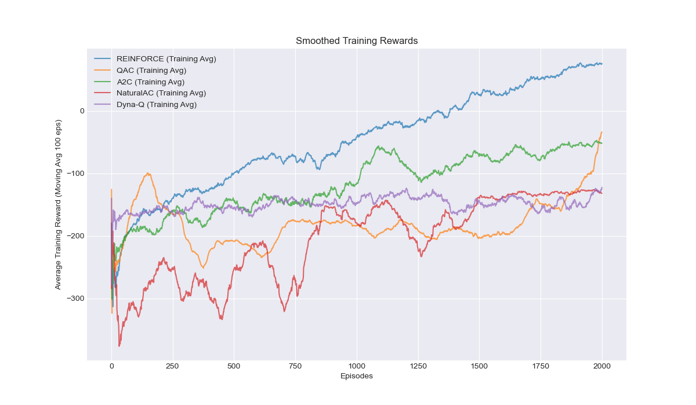
      学习率为0.001时，各算法在评估阶段的平均奖励随训练回合数的变化。

    * **训练过程平均奖励曲线 (Training Reward Curve)**:
      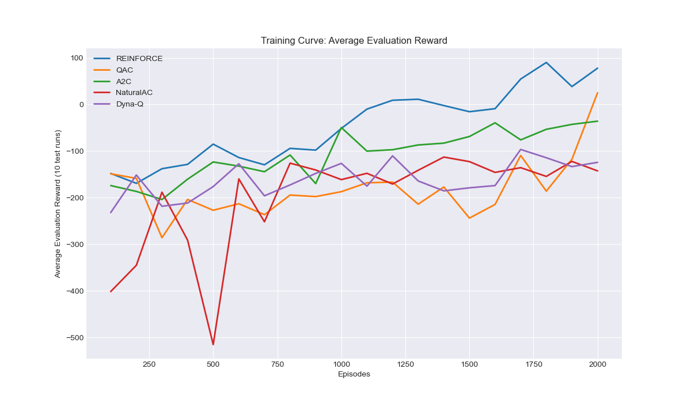
      学习率为0.001时，各算法在训练过程中的移动平均奖励（例如最近100个episodes的平均）。

    * **成功率曲线 (Success Rate Curve)**:
      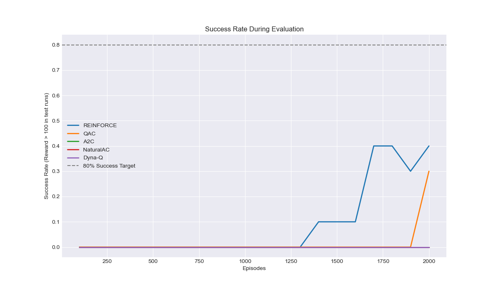
      学习率为0.001时，各算法在评估阶段的成功率（奖励 > 100的比例）随训练回合数的变化。

    * **最终性能箱线图 (Final Performance Boxplot)**:
      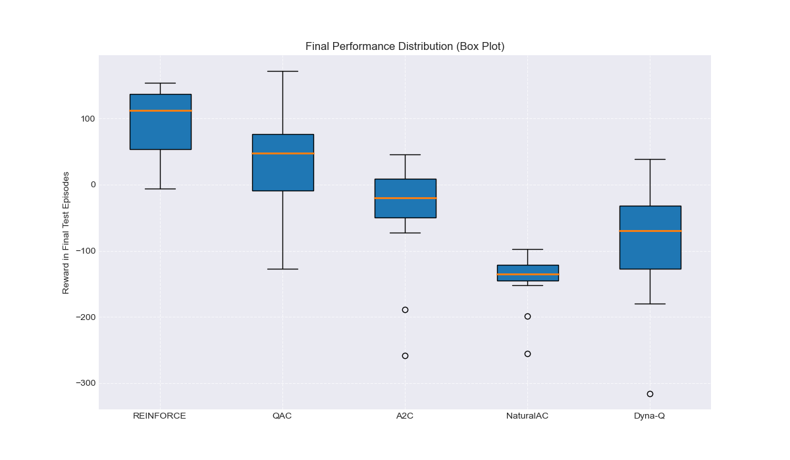
      学习率为0.001时，各算法在训练结束后的最终测试中（例如最后10-20个测试episodes）的奖励分布情况。

#### 学习率 (LR) = 0.01:
* **文字分析**:
    * **REINFORCE**: 表现最佳，在1000 episodes时成功率达到0.9，平均奖励超过200分，是唯一达到80%成功率收敛标准的算法。之后性能有所波动。
    * **QAC**: 表现不稳定，早期有一定学习趋势，但未能持续，最终平均奖励约20分。
    * **A2C**: 表现有所改善但仍不佳，平均奖励在0附近波动，未能有效解决问题。
    * **NaturalAC**: 表现极差，平均奖励远低于-500，表明学习过程可能发散或陷入了非常差的局部最优。
    * **Dyna-Q**: （学习率固定为0.1）表现依然不佳。
    * **小结**: LR=0.01 对 REINFORCE 效果显著。QAC 和 A2C 略有起色但远未成功。NaturalAC 在此学习率下完全失效，可能由于Fisher矩阵估计不准或更新步长过大导致不稳定。
  
* **可视化结果 (LR = 0.01)**:
    * **训练评估奖励曲线 (Evaluation Reward Curve)**:
      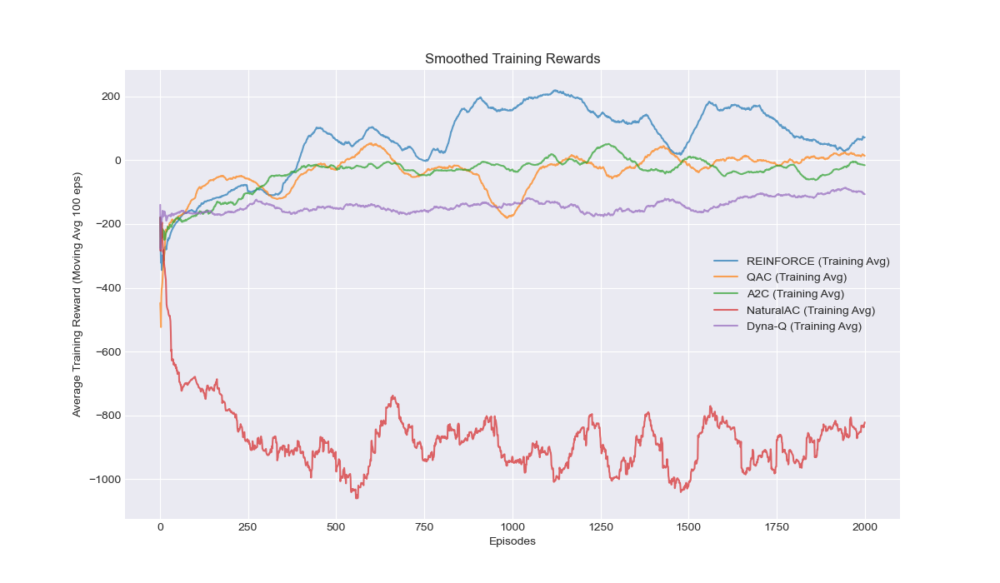
      学习率为0.01时，各算法在评估阶段的平均奖励随训练回合数的变化。

    * **训练过程平均奖励曲线 (Training Reward Curve)**:
      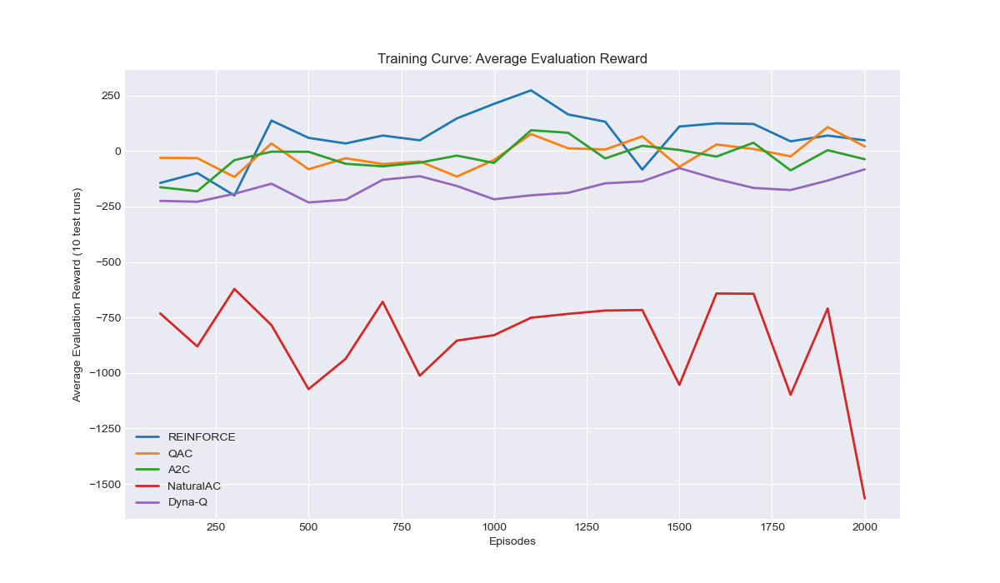
      学习率为0.01时，各算法在训练过程中的移动平均奖励（例如最近100个episodes的平均）。

    * **成功率曲线 (Success Rate Curve)**:
      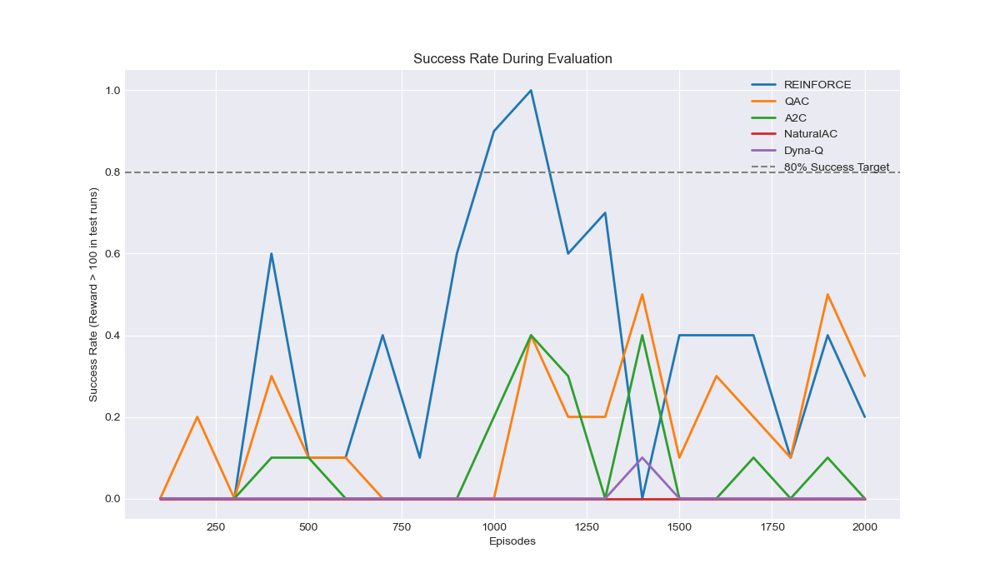
      学习率为0.01时，各算法在评估阶段的成功率（奖励 > 100的比例）随训练回合数的变化。

    * **最终性能箱线图 (Final Performance Boxplot)**:
      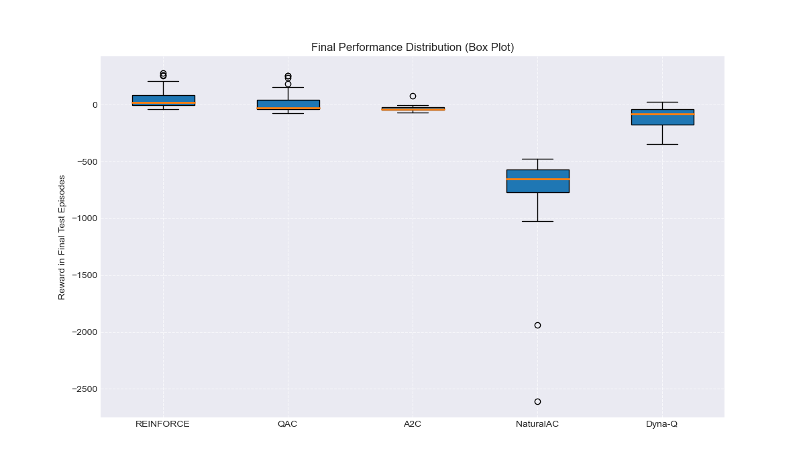
      学习率为0.01时，各算法在训练结束后的最终测试中（例如最后10-20个测试episodes）的奖励分布情况。

#### 学习率 (LR) = 0.1:
* **文字分析**:
    * **REINFORCE**: 学习完全失败，平均奖励大幅度为负。
    * **QAC**: 学习完全失败。
    * **A2C**: 学习完全失败。
    * **NaturalAC**: 尽管前几个评估点奖励为负一百多，相较于REINFORCE、QAC、A2C的负几百甚至上千略好，但整体学习完全失败。
    * **Dyna-Q**: （学习率固定为0.1）表现依然不佳。
    * **小结**: LR=0.1 对于所有基于神经网络的算法来说都过大，导致学习过程不稳定甚至发散。
* **可视化结果 (LR = 0.1)**:
    * **训练评估奖励曲线 (Evaluation Reward Curve)**:
      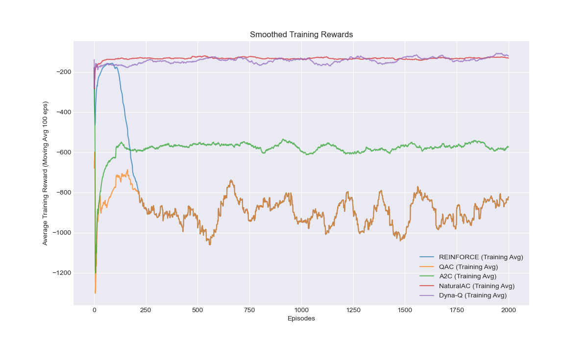
      学习率为0.1时，各算法在评估阶段的平均奖励随训练回合数的变化。

    * **训练过程平均奖励曲线 (Training Reward Curve)**:
      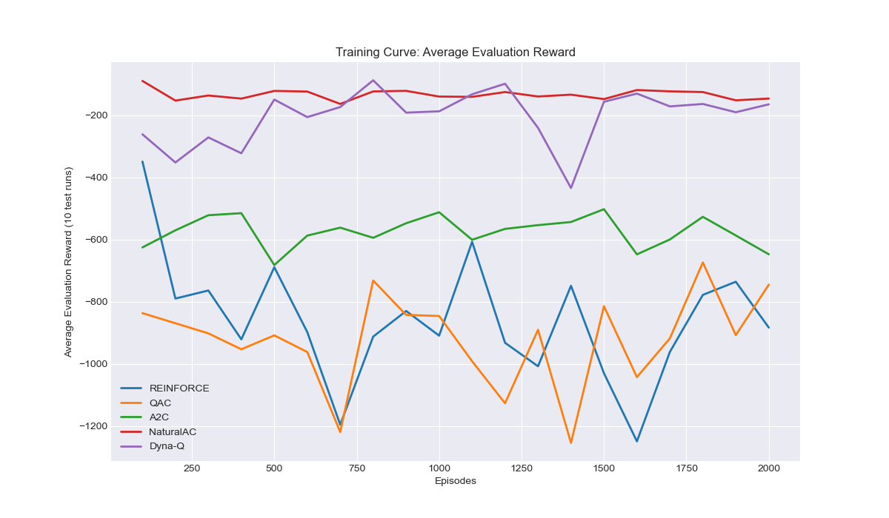
      学习率为0.1时，各算法在训练过程中的移动平均奖励（例如最近100个episodes的平均）。

    * **成功率曲线 (Success Rate Curve)**:
      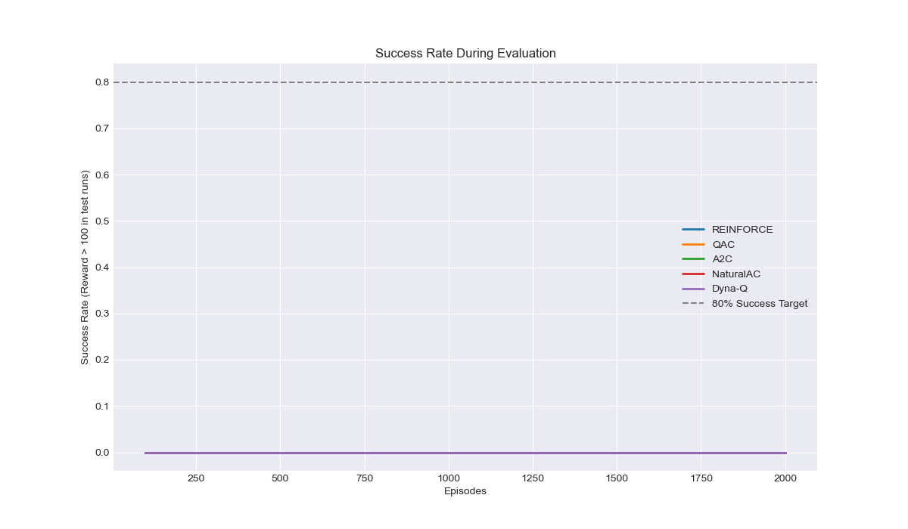
      学习率为0.1时，各算法在评估阶段的成功率（奖励 > 100的比例）随训练回合数的变化。

    * **最终性能箱线图 (Final Performance Boxplot)**:
      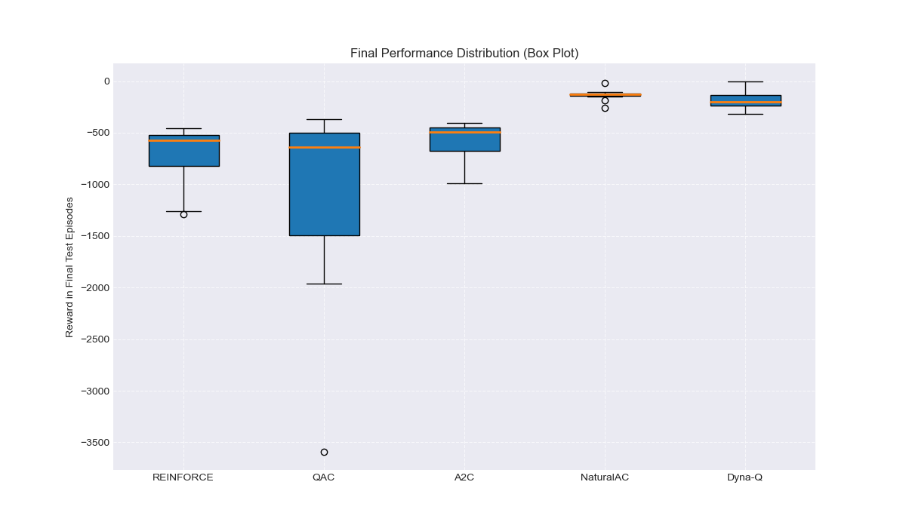
      学习率为0.1时，各算法在训练结束后的最终测试中（例如最后10-20个测试episodes）的奖励分布情况。

### 3.2 各算法综合表现对比 (以最佳学习率结果为参考)

* **REINFORCE (LR=0.01)**: 在本次实验中表现最好，是唯一能够稳定学习并达到80%成功率的算法。其学习曲线显示了典型的策略梯度方法通过探索最终找到较优策略的过程，但后期性能有所回落，显示出一定的方差。
* **QAC (LR=0.01时相对较好，但整体不佳)**: 尽管在LR=0.01时，QAC在早期表现出一些学习的潜力，但未能持续。整体来看，QAC在本实验中对超参数较为敏感，未能稳定收敛。
* **A2C (LR=0.01时相对较好，但整体不佳)**: A2C在不同学习率下均未表现出良好的学习能力。理论上A2C应比REINFORCE更稳定，但实验结果并未体现这一点，可能需要更细致的调参或网络结构调整。
* **NaturalAC (LR=0.001时相对“不那么差”，但整体表现最差)**: NaturalAC在所有学习率下均表现不佳，尤其是在LR=0.01和0.1时性能急剧恶化。这可能反映了其实现的复杂性、对超参数（如CG迭代、阻尼、FIM更新）的高度敏感性，或者Fisher矩阵近似和自然梯度计算中潜在的数值稳定性问题。
* **Dyna-Q (固定LR alpha=0.1)**: Dyna-Q在所有实验中均表现不佳。理论上Dyna-Q应有较好的样本效率，但在LunarLander这种连续状态空间问题中，其性能高度依赖于状态离散化的好坏、模型的准确性以及规划步数。当前采用的离散化方式（8维状态，bins数量有限）可能不足以捕捉状态的关键信息，或者5个规划步数不足以充分利用学习到的模型。

### 3.3 收敛速度 
* **REINFORCE (LR=0.01)**: 在1000个episodes时达到90%的成功率，是唯一达到80%收敛标准的算法。
* **其他所有算法**: 在2000个episodes的训练内，均未能达到80%的成功率标准。

## 4. 算法对比分析表 

| 算法        | 优点                                                                 | 缺点                                                                                               | 适用场景                                                     |
|-------------|----------------------------------------------------------------------|----------------------------------------------------------------------------------------------------|--------------------------------------------------------------|
| REINFORCE   | 实现简单；直接优化策略，适用于连续和离散动作空间（本实验为离散）。         | 样本效率低，学习过程中方差大，容易收敛到局部最优，对超参数敏感。                                             | 简单问题，作为基线算法，或当不需要值函数近似时。                     |
| QAC         | 引入Critic估计V值，用TD误差作为Q值或优势的估计，试图降低REINFORCE的方差。 Actor和Critic可以异步更新。 | 仍可能存在较高方差；对Critic的准确性有一定依赖；可能不如A2C稳定。                                       | 需要比REINFORCE更稳定学习的场景，但复杂度适中。                    |
| A2C         | 使用优势函数（如GAE）更准确地评估动作，进一步降低方差；通常比REINFORCE更稳定和高效。可以并行化（但本实验为单线程）。 | Critic的偏差可能影响Actor的学习；对网络结构和超参数仍较敏感。                                               | 各种离散或连续控制任务，是目前较常用的策略梯度方法之一。           |
| NaturalAC   | 使用Fisher信息矩阵对梯度进行调整，理论上能提供更优的更新方向和更快的收敛速度，对参数化不敏感。 | 计算复杂度高（FIM的计算和求逆或CG求解）；实现复杂；对近似FIM的方法和相关超参数（如阻尼）敏感，数值稳定性可能存在问题。 | 当普通梯度方法收敛慢或不稳定，且计算资源允许时可以尝试。         |
| Dyna-Q      | 通过学习环境模型并进行规划，可以显著提高样本效率；能更好地利用过去的经验。     | 模型的准确性对性能至关重要，复杂环境下模型学习困难；对于连续状态空间，依赖于状态离散化的好坏；规划步骤会增加计算开销。 | 样本获取成本高的场景；环境模型相对容易学习的场景。                 |

## 5. 关键发现讨论

### 5.1 优势函数如何降低方差
理论上，Actor-Critic方法（如QAC, A2C, NaturalAC）通过引入一个Critic来学习值函数（例如，状态值 V(s) 或状态-动作值 Q(s,a)），并使用这个值函数来计算优势函数 A(s,a) = Q(s,a) - V(s) (或其近似，如TD误差 R + gamma * V(s') - V(s)，其中 gamma 是折扣因子，V(s') 是下一状态的状态值)。相比于REINFORCE直接使用蒙特卡洛回报 G_t 作为梯度加权，优势函数提供了一个“基线”，指出了当前动作比在该状态下的平均动作好多少。这有助于减小策略梯度的方差，因为 G_t 本身可能因随机性而有很大波动。
从本次实验结果来看：
* REINFORCE (LR=0.01) 虽然最终表现最好，但其学习曲线也显示出一定的波动。
* QAC 和 A2C 在 LR=0.01 时也展现出一些学习能力，但未能超越REINFORCE，且稳定性不足。这可能表明在当前实现和超参数下，优势函数带来的方差降低效果没有完全转化为更优的性能，或者这些算法本身对LunarLander的超参数更敏感。
* 如果QAC/A2C的实现和调参更优，我们期望看到比REINFORCE更平滑的学习曲线和更快的稳定收敛。目前结果提示我们，理论优势需要在实践中通过精心设计和调整才能体现。

### 5.2 模型学习对样本效率的影响
Dyna-Q的核心思想是通过学习一个环境模型，并在真实交互之间进行额外的“模拟”学习（规划），从而更充分地利用每一条真实经验，以期提高样本效率。
然而，在本次实验中，Dyna-Q在所有学习率配置下（其自身学习率 alpha 固定为0.1）均表现不佳。这揭示了Dyna-Q在应用于像LunarLander这样的具有连续状态空间的问题时的挑战：
* **状态离散化**：Dyna-Q的表格型模型和Q-table依赖于有效的状态离散化。LunarLander的8维连续状态空间如果离散化过粗，会丢失关键信息，导致模型不准确，Q值泛化能力差。如果离散化过细，Q-table和模型会变得异常庞大，难以学习和存储。我们采用的`[10, 10, 8, 8, 6, 6, 2, 2]`的bins设置可能仍不理想。
* **模型准确性**：即使离散化合理，学习到的模型 (通常表示为 Model(s,a) 预测奖励 R 和下一状态 s') 也可能与真实环境存在误差。基于不准确模型的规划可能会误导Q函数的学习。
* **规划步数**：`planning_steps = 5` 可能不足以充分传播学习到的模型知识。更多的规划步数可能会有帮助，但也会增加计算时间。
* **探索与模型偏差**：如果探索不足，模型可能只学习到状态空间的一小部分，导致规划局限于已知区域，难以发现更优策略。
因此，尽管Dyna-Q理论上具有样本效率优势，但在本实验的特定设置下，这些优势未能体现，反而受到了离散化和模型学习准确性的限制。

### 5.3 自然梯度与普通策略梯度的收敛性差异
自然策略梯度（NaturalAC）通过使用Fisher信息矩阵的逆来对普通梯度进行缩放，旨在找到参数空间中关于KL散度度量下的最速下降（或上升）方向。理论上，这可以使其对参数的具体形式不那么敏感，并可能加速收敛，尤其是在病态的损失平面上。
在本次实验中：
* **A2C** (作为一种使用普通策略梯度的Actor-Critic方法) 在LR=0.01时表现一般，未能有效解决问题。
* **NaturalAC** 在所有学习率下均表现非常差，尤其是在LR=0.01和0.1时，其性能远劣于A2C甚至REINFORCE。在LR=0.001时，虽然也是负奖励，但没有出现其他学习率下那种极端负值的情况。

这种差异表明，尽管自然梯度有其理论优势，但其实际应用面临巨大挑战：
* **实现复杂度与数值稳定性**：NaturalAC的实现远比A2C复杂，涉及到FIM的近似计算、存储（如果显式计算）以及通过共轭梯度法求解线性方程组。这些步骤都可能引入数值不稳定性或bug。例如，FIM可能不是严格正定的，CG求解可能不收敛或给出错误的方向。
* **超参数敏感性**：NaturalAC引入了更多自身的超参数，如CG迭代次数、阻尼系数 lambda（用于 F + lambda * I 的形式，其中F是FIM，I是单位矩阵）、FIM更新频率、KL散度步长限制等。这些参数的设置对算法性能至关重要，不当的设置很容易导致学习失败。本次实验中 `max_kl_step = 0.01` 和 `cg_damping = 1e-3` 等参数可能不是最优的。
* **FIM近似的质量**：经验FIM的质量依赖于采样数据的分布。如果采样数据不足或分布不佳，FIM近似可能很差，导致自然梯度方向并非更优。
因此，实验结果显示，在当前实现和调参水平下，NaturalAC的理论优势未能发挥，反而因其复杂性和敏感性导致了更差的性能。这提示我们需要对NaturalAC的实现进行更细致的检查和大量的超参数调整，才能期望看到其优于普通梯度方法的表现。
## 6. 结论与展望

### 6.1 主要结论
* 在本次针对LunarLander-v2环境的五种强化学习算法比较实验中，**REINFORCE算法在学习率为0.01的配置下表现最佳**，是唯一能够达到80%成功率收敛标准的算法，尽管其学习过程也存在一定波动。
* QAC和A2C算法在当前超参数设置下表现不稳定，未能充分发挥Actor-Critic框架相对于纯策略梯度方法的优势。
* NaturalAC算法由于其实现的复杂性和对超参数的高度敏感性，在所有测试的学习率下均表现不佳，远未达到理论上的优越性。
* Dyna-Q算法同样表现不佳，表明在连续状态空间问题中，其性能受到状态离散化、模型准确性和规划深度的严重制约。
* 学习率是影响基于梯度优化的强化学习算法性能的关键超参数，过大或过小的学习率都可能导致学习失败或效率低下。

### 6.2 存在的问题与未来工作
* **超参数调优**：对于表现不佳的算法（特别是QAC, A2C, NaturalAC, Dyna-Q），需要进行更广泛和细致的超参数搜索，包括学习率、网络结构、折扣因子、GAE的$\lambda$、NaturalAC的CG参数和KL步长、Dyna-Q的bins数量和规划步数等。
* **Dyna-Q改进**：可以尝试更高级的状态表示方法（如使用函数近似代替离散化，或使用更精细的自适应离散化），以及更有效的模型学习和规划策略。
* **NaturalAC稳定性**：需要仔细检查NaturalAC的实现细节，特别是FIM的计算和CG求解过程，确保其数值稳定性和正确性。可以尝试不同的FIM近似方法或CG的变体。
* **增加训练量与评估细度**：对于一些算法，可能需要更多的训练回合数才能充分学习。同时，可以增加评估的频率和每次评估的测试回合数，以获得更平滑和可靠的性能曲线。
* **策略可视化对比**：根据项目要求，可以进一步实现对训练好的最佳策略进行可视化，例如展示在相同初始状态下的着陆轨迹，以更直观地比较不同算法学到的策略。